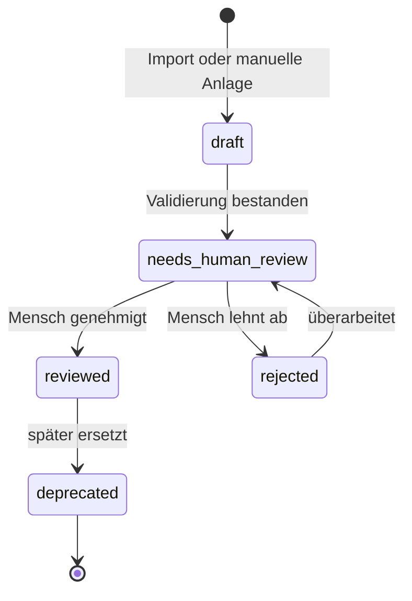
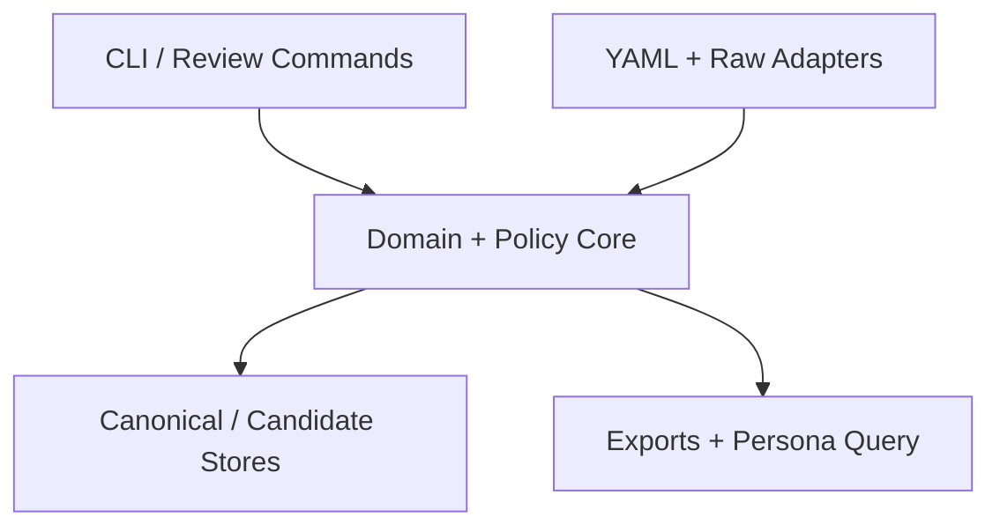

# Mechanicus Quote Database – Build- und Agentenplan

**Arbeitsname:** Mechanicus Quote Database (MQD)
**Dokumentstatus:** Build-ready Planungspaket
**Erstellt:** 2026-08-05
**Quellsprache:** Deutsch
**Ziel:** Vollständige Überführung der vorhandenen Projektidee in einen umsetzbaren, rückverfolgbaren Plan

> Dieses Dokument formalisiert die Intention aus dem vorhandenen Lastenheft, dem Schemaentwurf, der Beispiel-YAML und dem früheren Persona-Kontext. Es implementiert die Anwendung noch nicht. Empfehlungen und Annahmen sind ausdrücklich markiert; die drei Ausgangsartefakte bleiben unverändert daneben erhalten.

## 1. Executive Summary, v1-Grenze und Entscheidungen mit hoher Wirkung

Die MQD soll kein loses Zitatearchiv werden, sondern eine lokale, quellenbewusste und maschinenlesbare Wissensbasis. Sie versorgt eine Techpriest-Persona mit zur Situation passenden, ausreichend belegten Mechanicus-Aussprüchen und kann neue Fundstellen halbautomatisch in eine Kandidatenwarteschlange überführen. Der entscheidende Qualitätsmechanismus lautet: **Der Agent darf selbstständig finden, parsen, klassifizieren und vorschlagen; nur ein Mensch darf einen Kandidaten in den kanonischen Bestand freigeben.**

### v1 in einem Satz

v1 endet bei einem lokal ausführbaren CLI-Workflow, der private YAML-Einträge und explizit autorisierte Quellsnapshots validiert, normalisiert, auf Dubletten prüft, als JSON/Markdown exportiert, kontextbezogen für die Persona abfragt und agentisch erzeugte Kandidaten erst nach menschlichem Review in den kanonischen Bestand übernimmt.

### Was v1 ausdrücklich enthält

- kanonische YAML-Daten, getrennte Quellen- und Tag-Registry sowie ein striktes JSON Schema;
- 20–50 privat kuratierte Datensätze aus beiden vorgesehenen Quellseiten als Abnahmebestand;
- deterministische Validierung, Normalisierung, Dublettenprüfung und JSON-/Markdown-Exporte;
- eine versionierte Persona-Abfrage mit Qualitäts-, Rechte-, Kontext-, Intensitäts- und Wiederholungsfiltern;
- eine kontrollierte Erweiterungspipeline von autorisiertem Rohsnapshot zu Draft-Kandidat, Prüfbericht und menschlicher Freigabe;
- eine fail-closed Trennung zwischen privatem Volltextbestand und öffentlichem Repository/Export;
- Tests, CI, Dokumentation, Backup-/Restore-Probe und ein reproduzierbarer Release-Gate.

### Was erst nach v1 folgt

- SQLite/FTS5 als abgeleiteter Suchindex;
- Web-Review-UI, Telegram-Bot, OpenClaw-Adapter, LED-Matrix-Export, Audio/TTS und Embeddings;
- opt-in geplante Quellenprüfungen oder zusätzliche Quellen jenseits der anfänglichen Allowlist;
- öffentliche Volltextbereitstellung oder eine öffentliche Volltext-API.

### Entscheidungen mit hoher Wirkung

| ID | Entscheidung | Status | Begründung |
|---|---|---|---|
| DEC-1 | YAML bleibt kanonisch; JSON, Markdown und SQLite sind vollständig neu erzeugbare Artefakte und dürfen nie zurück in YAML synchronisiert werden. | Bestätigt aus Quelle, präzisiert | Verhindert zwei konkurrierende Wahrheiten und Drift. |
| DEC-2 | Die Erweiterungsautomatik schreibt ausschließlich Kandidaten; kanonische Promotion verlangt einen protokollierten menschlichen Review. | Empfohlen | Erhält die gewünschte Selbstständigkeit ohne Halluzinationen oder unkontrollierte Übernahme. |
| DEC-3 | Öffentliche und private Daten werden physisch und durch Export-Policy getrennt; der öffentliche Default ist fail-closed. | Bestätigt aus Quelle | Das Ziel-Repository ist öffentlich, während Beispiel und Lastenheft Volltexte als privat/reference-only markieren. |
| DEC-4 | `source_quality`, `review.status` und Dublettenstatus werden getrennte Zustandsdimensionen. | Empfohlen | `duplicate_candidate` beschreibt keine Quellenqualität und würde Filter semantisch verfälschen. |
| DEC-5 | Der v1-Stack ist ein Python-Paket mit einem einzigen CLI-Einstiegspunkt; `argparse`, `pathlib` und `sqlite3` kommen aus der Standardbibliothek, für YAML/Schema/Fuzzy-Matching werden kleine, gepinnte Bibliotheken genutzt. | Empfohlen | Passt zum vorhandenen Python-Tooling, bleibt lokal und vermeidet früh eine API-/UI-Plattform. |
| DEC-6 | Der Schema-Vertrag wird für Kernobjekte strikt (`additionalProperties: false`) und über explizite Erweiterungsobjekte versionierbar. | Empfohlen | Der vorhandene Entwurf nennt sich strikt, akzeptiert aktuell aber unbekannte Felder nahezu überall. |
| DEC-7 | `normalized_text` und andere ableitbare Felder werden gebaut statt manuell gepflegt; `canonical_text` wird nie durch Suchnormalisierung überschrieben. | Empfohlen | Bewahrt Texttreue und macht Builds reproduzierbar. |
| DEC-8 | Netzwerkzugriffe sind kein Bestandteil des Kernpfads. Ein Import darf nur nach expliziter Quellenfreigabe einen Snapshot erfassen; wiederkehrendes Crawling bleibt außerhalb von v1. | Bestätigt und präzisiert | Erfüllt local-first/offline und das ausdrückliche Nicht-Ziel eines unkontrollierten Crawlers. |

### Diagnose der drei vorhandenen Artefakte

- Das Lastenheft enthält bereits ein ungewöhnlich starkes Domänenmodell, klare Rechtehinweise, eine sinnvolle Pipeline und konkrete MVP-Kriterien. Es ist eher umfangreich als dürftig, aber Anforderungen, Architekturidee und Beispiele sind mehrfach vermischt.
- `quote_entry.schema.json` ist syntaktisch gültiges JSON und adressiert Draft 2020-12. Es bildet jedoch Pflichtrechte, optionale Erweiterungsfelder, Dublettenmodell und echte Striktheit noch nicht ab; `rights` ist trotz L-009 nicht verpflichtend und `use_policy` ist unbeschränkt.
- `quotes.example.yaml` ist syntaktisch gültig, enthält zwei sichere Platzhalterdatensätze und dokumentiert die private Rechtepolitik. Einige Beispiel-Tags fehlen in der vorläufigen Taxonomieliste; das ist ein notwendiger Registry-Testfall, kein Grund, die Beispiele zu verwerfen.

## 2. Idea Draft

### 2.1 Source Record

- **Input form:** drei angehängte Dateien, aktuelle Nutzerbeschreibung und relevanter früherer Projekt-/Persona-Kontext
- **Quellsprache:** überwiegend Deutsch; Datenfelder und technische Begriffe teilweise Englisch
- **Primärquellen:**
  - `docs/mechanicus_quote_db_design_lastenheft.md`, 1.403 Zeilen, SHA-256 `b84db9d5b545092548ca925ce6c0ef3aec0c80fbaa14f8b9acbfa9029cb3f1db`
  - `schema/quote_entry.schema.json`, 222 Zeilen, SHA-256 `8991700ed44c400af64bf2dcc866f5b0d59834f5f541571df5eec317f378a3ae`
  - `examples/quotes.example.yaml`, 143 Zeilen, SHA-256 `2322a0bd133b8907af3181ee878963562e0610931ab5200598f9bff75ae6fc96`
- **Ergänzender Kontext:** früheres Ziel „skurrile Adeptus-Mechanicus-Aussprüche für mehr Flair“ sowie Persona-Stil aus ritualisierter Technikverehrung, Bewahrung statt Innovation, formaler fragmentarischer Sprache, Pseudo-Latein und sparsamen Binär-/Code-Einsprengseln
- **Input snapshot:** Die Originaldateien sind unverändert im Repository erhalten; die folgenden IDs verweisen auf konkrete Abschnitte statt Volltext zu duplizieren.

### 2.2 Source Synopsis

- **Working title:** Mechanicus Quote Database (MQD)
- **One-sentence concept:** Eine lokale, kuratierte und erweiterbare Zitat-/Liturgie-Datenbasis, die einer Techpriest-Persona belegtes, kontextpassendes Flair gibt und neue Kandidaten unter menschlicher Qualitätskontrolle aufnehmen kann.
- **Problem/opportunity:** Wiki-Quellen sind strukturell inkonsistent, teilweise schlecht belegt und für Agenten nicht unmittelbar nutzbar; eine flache Textliste kann weder Herkunft noch Ton, Verwendung, Rechte oder Qualität zuverlässig steuern.
- **Intended users/stakeholders:** privater Kurator/Betreiber, Techpriest-Persona bzw. konsumierender Agent, Erweiterungsagent, spätere Bot-/UI-/Display-Adapter, öffentliche Repository-Leser ohne Zugriff auf private Volltexte.
- **Primary outcome:** Die Persona kann lokal und ohne Halluzination ein geeignetes, nachvollziehbares Zitat oder einen sicheren Fallback abrufen; neue Inhalte gelangen nachvollziehbar von einer autorisierten Quelle bis zur menschlichen Freigabe.
- **Explicit success signals:** 20–50 geprüfte Einträge aus beiden Ausgangsseiten; valide YAML-/JSON-Artefakte; kontrollierte Tags; sichtbare Quellenqualität; Dublettenbericht; funktionsfähige Markdown-Ausgabe; mindestens drei sinnvolle Trigger; Offline-Nutzung.
- **Explicit non-negotiables:** Quellenlinie pro Eintrag, Unsicherheit sichtbar lassen, stabile IDs nicht wiederverwenden, private Drittanbieter-Volltexte nicht standardmäßig öffentlich exportieren, keine vollautomatische ungeprüfte Veröffentlichung und kein unkontrollierter periodischer Crawler.

### 2.3 Atomic Source Inventory

| Source ID | Atomare Quellaussage | Evidenz / Locator | Interpretationshinweis |
|---|---|---|---|
| SRC-1 | Der Nutzer will eine Datenbank zusammengetragener Adeptus-Mechanicus-Zitate, die eine vorhandene Persona nutzt und nach Möglichkeit schrittweise erweitert. | Aktuelle Nutzerbeschreibung | „Selbstständig erweitern“ beschreibt ein Ziel, nicht automatisch das Recht zur Freigabe. |
| SRC-2 | Die Sammlung soll durch skurrile Aussprüche mehr Flair erzeugen. | Früherer Projektkontext | Persona-Nutzen ist primär atmosphärisch, nicht faktische Lore-Beratung. |
| SRC-3 | Ausgangspunkt sind Quote-, Litany-, Hymn-, Creed- und Excerpt-Inhalte zweier Lexicanum-Seiten. | Lastenheft Z. 1–23 | Weitere Quellen sind Erweiterung, nicht v1-Voraussetzung. |
| SRC-4 | Die Wissensbasis soll für Menschen und für Agenten, Bots, UIs, Random-Auswahl, RAG und Persona-Systeme nutzbar sein. | Lastenheft Z. 21–24 | Downstream-Anbindungen haben unterschiedliche Prioritäten. |
| SRC-5 | YAML ist Pflegeformat, JSON Austauschformat, SQLite optionaler Suchindex. | Lastenheft Z. 27–68, 656–729 | Nur YAML ist autoritativ; „JSON als technische Wahrheit“ wird als generiertes Contract-Artefakt präzisiert. |
| SRC-6 | Jeder Eintrag braucht mehrstufige Herkunft bis hin zu Abrufversion, In-Lore-Ursprung und Publikationsquelle. | Lastenheft Z. 78–87 | Fehlende Unterstufen bleiben explizit `null`, nicht erfunden. |
| SRC-7 | Unsichere oder quarantänierte Quellen dürfen nicht versteckt oder als verifiziert ausgegeben werden. | Lastenheft Z. 88–90, 389–404 | Qualitätsstatus muss Filter und UI beeinflussen. |
| SRC-8 | Gespeichert werden neben Text auch Sprecher/Ursprung, Kontext, Kategorie, Thema, Ton, Nutzungsfälle, Trigger, Persona-/UI-Eignung und Quellenqualität. | Lastenheft Z. 92–105, 149–223 | Kernargument gegen eine flache Liste. |
| SRC-9 | Das Modell soll zusätzliche Quellen, Übersetzungen, Paraphrasen, Audio, Persona-Metadaten und Embeddings später aufnehmen. | Lastenheft Z. 107–110, 294–335 | Erweiterbarkeit darf Kernvalidierung nicht permissiv machen. |
| SRC-10 | IDs sind stabil, sortierbar, werden nie wiederverwendet; entfernte Einträge werden abgelehnt/deprecated statt still gelöscht. | Lastenheft Z. 339–359 | Erfordert Lifecycle- und Migrationsregeln. |
| SRC-11 | Quellen und Tags werden in separaten, kontrollierten Registries gepflegt. | Lastenheft Z. 225–261, 421–505 | Einträge referenzieren Registry-IDs; eingebettete Snapshots sind nur Denormalisierung. |
| SRC-12 | Import läuft über Rohsnapshot, Parser, Draft, Normalisierung, redaktionelle Prüfung und Export. | Lastenheft Z. 509–593 | Stufen müssen einzeln wiederholbar und auditierbar sein. |
| SRC-13 | Gültigkeit umfasst eindeutige ID, Text, URL, kontrollierte Kategorien/Qualität/Tags und markierte Dubletten. | Lastenheft Z. 597–610, 1237–1252 | JSON-Schema allein reicht für Registry- und corpusweite Regeln nicht. |
| SRC-14 | Dubletten werden exakt, normalisiert und unscharf erkannt; 92 % ist ein Beispielschwellwert. | Lastenheft Z. 611–627 | Der Schwellwert bleibt konfigurierbar und wird mit Fixtures kalibriert. |
| SRC-15 | Mehrzeilige Liturgien und UI-Lesbarkeit müssen erhalten bzw. beschrieben werden. | Lastenheft Z. 560–570, 628–639 | Kanonischer Text und Präsentationsmetadaten bleiben getrennt. |
| SRC-16 | Persona-Auswahl filtert nach Trigger, Quellenqualität und Intensität und kann gewichtet zufällig auswählen. | Lastenheft Z. 873–898 | Wiederholungsvermeidung und leerer Fallback sind notwendige Inferenz. |
| SRC-17 | Spätere Verbraucher sind CLI, Telegram, Dashboard, LED-Matrix, OpenClaw, RAG und Audio/TTS. | Lastenheft Z. 899–961, 1103–1169 | Nur CLI/Persona-Contract sind v1; Adapter bleiben Backlog. |
| SRC-18 | Drittanbieter-Volltexte sind private lokale Referenzdaten; öffentliche Repositories/Exporte sollen Schema, Werkzeuge, Platzhalter oder eigene Paraphrasen enthalten. | Lastenheft Z. 963–984, 1324–1335; Beispiel-YAML Z. 61–64, 133–136 | Bindende Daten- und Veröffentlichungsgrenze. |
| SRC-19 | Muss: kanonische YAML-Dateien und automatischer valider UTF-8-JSON-Export mit erhaltenen Zeilenumbrüchen. | Lastenheft L-001/L-002, Z. 994–1015 | Beide werden v1 Must. |
| SRC-20 | Muss: Quellenmodell und Klassifikation mit Attribution, Qualität sowie mindestens einem semantischen und Stil-Tag. | Lastenheft L-003/L-004, Z. 1016–1038 | Registerreferenzen werden mitvalidiert. |
| SRC-21 | Muss: Review-Workflow und zentrale Tag-Registry mit fehlerschlagender Validierung bei unbekannten Tags. | Lastenheft L-005/L-006, Z. 1039–1058 | Promotion ist eine explizite Zustandsänderung. |
| SRC-22 | Muss: lesbarer Markdown-Export und Dublettenbehandlung. | Lastenheft L-007/L-008, Z. 1059–1079 | Beide benötigen deterministische Tests. |
| SRC-23 | Muss: Rechte-Metadaten und Erweiterbarkeit für Quellen, Sprachen, Trigger und optional SQLite. | Lastenheft L-009/L-010, Z. 1080–1102 | Rechtefelder werden im korrigierten Schema zwingend. |
| SRC-24 | Soll: SQLite, CLI, Fuzzy Search, Trigger-Auswahl, Persona-Scoring und optionale deutsche Übersetzung. | Lastenheft S-001–S-006, Z. 1103–1147 | CLI/Trigger/Persona werden durch die aktuelle Nutzerabsicht zu v1 Must hochgestuft; SQLite/Übersetzung bleiben Should. |
| SRC-25 | Kann: lokale Web-UI, Telegram, OpenClaw, LED-Matrix und Audio/TTS. | Lastenheft K-001–K-005, Z. 1149–1169 | Sichtbar bewahrter Post-v1-Backlog. |
| SRC-26 | Nicht-Ziele: ungeprüfte Volltextveröffentlichung, öffentliche Volltext-API, vollständige Primärprüfung, automatische Gesamtübersetzung, Pflicht-Embeddings, unkontrolliertes regelmäßiges Scraping. | Lastenheft Z. 1173–1184 | Harte v1-Prohibitionen. |
| SRC-27 | Der ursprüngliche MVP verlangt mindestens 20 Datensätze aus beiden Seiten, Schema-/Tagvalidität, JSON/Markdown, drei Kontexte, Qualitätsfilter, Dublettenreport und Offline-Nutzung. | Lastenheft Z. 1186–1234, 1307–1320 | Durch aktuelle Persona-/Erweiterungsabsicht um Retrieval und Kandidatenpipeline ergänzt. |
| SRC-28 | Das vorhandene Schema definiert Kernfelder, Enums und Bereichsgrenzen, erlaubt aber unbekannte Felder und macht `rights` nicht verpflichtend. | Schema Z. 1–222 | Dokumentierter Vertragsrückstand, nicht beabsichtigte Freiheit. |
| SRC-29 | Die Beispiel-YAML enthält zwei volltextfreie Datensätze mit privaten Rechteflags und menschlichem Reviewbedarf. | Beispiel-YAML Z. 1–143 | Geeignet als öffentliche Strukturfixture, nicht als Abnahmedatensatz. |
| SRC-30 | Persona-Stil: Technologie als heilige Manifestation, ritualisierte Diagnose/Reparatur, Bewahrung vor Innovation, formale Fragmente, Pseudo-Latein und sparsame Code-/Binärelemente. | Früherer Persona-Kontext | Stilmetadaten und Auswahl sollen diesen Charakter unterstützen, Zitate aber nicht erfinden. |
| SRC-31 | Das Ziel-Repository ist öffentlich und zu Planungsbeginn leer. | Verifizierter Repository-Zustand am 2026-08-05 | Erzwingt initial einen volltextfreien Commit. |
| SRC-32 | JSON und YAML der Ausgangsartefakte sind syntaktisch parsebar; die YAML enthält zwei eindeutige IDs. | Lokale Validierungsprüfung am 2026-08-05 | Semantische Korrektheit bleibt Aufgabe des neuen Validators. |

### 2.4 Capability Inventory

| ID | Capability / Verhalten | Evidenzklasse | Confidence | Priorität | Source IDs | Begründung / Abhängigkeiten |
|---|---|---|---|---|---|---|
| CAP-1 | Kanonischen, menschenlesbaren YAML-Korpus verwalten | Source-backed | High | Must | SRC-3, SRC-5, SRC-19 | Kern des Produkts. |
| CAP-2 | Einträge strukturell und corpusweit validieren | Source-backed | High | Must | SRC-13, SRC-19, SRC-28 | Kombiniert JSON Schema und Policy-Lints. |
| CAP-3 | Vollständige Quellenlinie und Rohsnapshot referenzieren | Source-backed | High | Must | SRC-6, SRC-11, SRC-12, SRC-20 | Verhindert unbelegte Attribution. |
| CAP-4 | Kontrolliert klassifizieren und taggen | Source-backed | High | Must | SRC-8, SRC-11, SRC-20, SRC-21 | Für Suche und Persona-Auswahl lasttragend. |
| CAP-5 | Review-/Lifecycle mit unverlierbarer Historie steuern | Source-backed | High | Must | SRC-7, SRC-10, SRC-21 | Qualität und Governance. |
| CAP-6 | Deterministische JSON- und Markdown-Artefakte bauen | Source-backed | High | Must | SRC-5, SRC-19, SRC-22 | Maschinen- und Menschenkonsum. |
| CAP-7 | Exakte, normalisierte und Fuzzy-Dubletten erkennen | Source-backed | High | Must | SRC-10, SRC-14, SRC-22 | Fuzzy-Schwelle muss kalibriert werden. |
| CAP-8 | Kontextpassenden Persona-Text sicher auswählen | Source-backed | High | Must | SRC-1, SRC-2, SRC-16, SRC-24, SRC-30 | Aktuelle Nutzerabsicht macht dies v1-kritisch. |
| CAP-9 | Autorisierte Rohquellen unveränderlich aufnehmen und parsen | Source-backed | High | Must | SRC-3, SRC-12, SRC-26 | Kein allgemeiner Crawler. |
| CAP-10 | Neue Kandidaten agentisch klassifizieren und vorschlagen | Inferred | High | Must | SRC-1, SRC-12, SRC-26 | Notwendig für kontrollierte Selbst-Erweiterung. |
| CAP-11 | Kandidaten ausschließlich nach menschlicher Prüfung promoten | Inferred | High | Must | SRC-7, SRC-21, SRC-26 | Sicherheitsgrenze für CAP-10. |
| CAP-12 | Rechtebewusste private/öffentliche Exporte fail-closed trennen | Source-backed | High | Must | SRC-18, SRC-23, SRC-26, SRC-31 | Öffentliche Repo-Lage erhöht Priorität. |
| CAP-13 | Korpus über CLI suchen, filtern, prüfen und abfragen | Source-backed | High | Must | SRC-4, SRC-16, SRC-24 | Kleinste nutzbare Schnittstelle. |
| CAP-14 | Optionalen SQLite-/FTS5-Index erzeugen | Source-backed | High | Should | SRC-5, SRC-17, SRC-24 | Abgeleitet, nicht kanonisch. |
| CAP-15 | Übersetzungen und optionale Medien-/RAG-Metadaten aufnehmen | Source-backed | Medium | Should | SRC-9, SRC-15, SRC-24 | Schemaextension, keine v1-Massenbefüllung. |
| CAP-16 | Spätere Bots, UI, OpenClaw, Displays, Audio und RAG anbinden | Source-backed | High | Could | SRC-4, SRC-17, SRC-25 | Contract wird vorbereitet; Implementierung deferred. |
| CAP-17 | Builds, Policy und Rückverfolgbarkeit automatisiert auditieren | Inferred | High | Must | SRC-5, SRC-13, SRC-18, SRC-27 | Erforderlich für reproduzierbare und sichere Freigaben. |

### 2.5 Cross-cutting Requirements

| ID | Anforderung / Constraint | Kategorie | Evidenzklasse | Priorität | Source IDs | Notiz |
|---|---|---|---|---|---|---|
| REQ-1 | Kernfunktionen müssen nach Installation ohne Netzwerk laufen. | Offline/Portabilität | Source-backed | Must | SRC-5, SRC-27 | Netz ist nur optionaler Snapshot-Input. |
| REQ-2 | Öffentliche Artefakte dürfen private Drittanbieter-Volltexte nicht enthalten. | Rechte/Privacy | Source-backed | Must | SRC-18, SRC-26, SRC-31 | Export und CI müssen fail-closed sein. |
| REQ-3 | Jede Transformation muss auf Eingabe, Toolversion und Bericht zurückführbar sein. | Auditierbarkeit | Inferred | Must | SRC-6, SRC-12, SRC-17 | Hashes und Manifest. |
| REQ-4 | Stabile IDs und Schema-Versionen müssen Migration ohne ID-Recycling erlauben. | Datenintegrität | Source-backed | Must | SRC-9, SRC-10, SRC-23 | Breaking changes brauchen Migrationspfad. |
| REQ-5 | Identische Eingaben und Konfiguration müssen byte-identische Exporte erzeugen. | Reproduzierbarkeit | Inferred | Must | SRC-5, SRC-19, SRC-27 | Sortierung und Zeitstempel außerhalb Payload. |
| REQ-6 | Unsicherheit, leere Treffer und Teilfehler müssen sichtbar sein; keine erfundenen Fallback-Zitate. | Zuverlässigkeit | Inferred | Must | SRC-7, SRC-16, SRC-26 | Persona liefert strukturierten Null-Fallback. |
| REQ-7 | Kernpfad braucht automatisierte Unit-, Contract-, Property- und End-to-End-Tests. | Maintainability | Inferred | Must | SRC-13, SRC-27 | Abnahmeevidenz statt manueller Hoffnung. |
| REQ-8 | HTML/YAML/Markdown gelten als untrusted input; Parser dürfen keinen Code ausführen und Exporte müssen sicher escapen. | Security | Inferred | Must | SRC-12, SRC-18 | Lokal heißt nicht vertrauenswürdig. |
| REQ-9 | Kein autonomer Prozess darf Review- oder Rechte-Gates umgehen. | Governance | Inferred | Must | SRC-1, SRC-18, SRC-21, SRC-26 | Maschinenlesbare Policy und getrennte Befehle. |
| REQ-10 | CLI-/Markdown-Ausgaben müssen verständliche Fehlerorte, klare Statuslabels und intakte Mehrzeilenstruktur liefern. | Usability/Accessibility | Source-backed | Should | SRC-15, SRC-22, SRC-24 | Auch ohne Web-UI bedienbar. |

### 2.6 Actors and Permissions

| Actor / Rolle | Ziele | Erlaubte Aktionen | Verbotene Aktionen | Source IDs |
|---|---|---|---|---|
| Kurator/Owner | Korpus pflegen, Quellen prüfen, Reviews entscheiden, Releases bauen | Registries ändern, Kandidaten prüfen, promoten/rejecten/deprecaten, private Exporte erzeugen | ID-Recycling; ungeprüfte Quellen als `verified` markieren | SRC-7, SRC-10, SRC-21 |
| Techpriest-Persona / Consumer | Ein belegtes, kontextpassendes Flair-Element erhalten | Versionierte Read-only-Abfrage mit Filtern | Korpus ändern; Reviewstatus hochstufen; bei Leertreffer Text erfinden | SRC-1, SRC-16, SRC-30 |
| Erweiterungsagent | Arbeitsaufwand für neue Inhalte senken | Autorisierte Snapshots parsen, Kandidaten/Tags/Quellenbezüge vorschlagen, Berichte schreiben | Kanonische Dateien oder Rechtefreigaben direkt ändern | SRC-1, SRC-12, SRC-26 |
| Build-/Release-Prozess | Daten und Artefakte reproduzierbar prüfen | Validieren, linten, exportieren, Policy-Gates ausführen | Fehler ignorieren; private Artefakte in öffentlichen Release aufnehmen | SRC-18, SRC-27, SRC-31 |
| Öffentlicher Repository-Leser | Schema, Tools, Architektur und sichere Fixtures verwenden | Öffentliche Dateien lesen/forken | Zugriff auf privaten Korpus erhalten | SRC-18, SRC-31 |
| Späterer Adapter | Persona-Query oder Export konsumieren | Read-only, versionierter Contract | Kanonischen Speicher direkt schreiben | SRC-4, SRC-17, SRC-25 |

### 2.7 Domain Model, States and Workflows

**Kernentitäten**

- `QuoteEntry`: kanonischer Text, Typ, Sprache, Herkunftsbezug, Klassifikation, Tags, Persona-Nutzung, Rechte, Review, Dublettenrelationen und Extension-Metadaten.
- `CandidateEntry`: maschinell erzeugter Vorschlag mit Parser-/Modellprovenienz; formal vom kanonischen Typ getrennt, bis alle Gates erfüllt sind.
- `SourceEntry`: stabile Quelle, URL/Publikation, Abruf-/Versionsdaten, Allowlist- und Quarantänestatus.
- `RawArtifact`: unveränderlicher Snapshot mit SHA-256, MIME-Typ, Erfassungszeit, Source-ID und lokaler Dateireferenz.
- `TagEntry`: kontrollierter Tag mit Kategorie, Beschreibung, Aliasen und erlaubten Record-Typen.
- `ReviewDecision`: Actor, Zeit, Entscheidung, Begründung, vorheriger/nächster Status und betroffener Record.
- `ImportRun`: Inputs, Parser-/Schema-Version, erzeugte Kandidaten, Warnungen, Fehler und Reporthash.
- `BuildManifest`: Hashes der kanonischen Inputs, Konfiguration, Toolversionen und generierten Artefakte.
- `PersonaQuery`: Trigger, Persona, Sprache, Intensitätsgrenze, Qualitätsminimum, Tagfilter und kürzlich verwendete IDs.
- `PersonaSelection`: gewählte Entry-ID plus begründende Metadaten oder strukturierter `no_match`-Fallback.

**Lifecycle**



`source_quality` (`verified`, `lexicanum_cited`, `lexicanum_uncited`, `quarantined`, `needs_review`) ist unabhängig vom Lifecycle. `duplicate_candidate` wandert in `duplicate.status` bzw. `review.flags` und ist keine Quellenqualität mehr.

**Primärer Happy Path**

1. Kurator registriert/autorisiert eine Quelle und erfasst einen lokalen Snapshot oder einen expliziten Eintrag.
2. System speichert Snapshot und Hash unveränderlich und beginnt einen `ImportRun`.
3. Parser extrahiert Kandidaten; Normalizer erzeugt nur abgeleitete Suchwerte.
4. Schema-, Registry-, Rechte- und Dublettenprüfungen erzeugen maschinen- und menschenlesbare Berichte.
5. Erweiterungsagent schlägt Klassifikation, Tags und Persona-Nutzung mit Confidence und Begründung vor.
6. Mensch prüft Quelle/Text/Metadaten und promotet oder verwirft.
7. Build erzeugt deterministisch JSON und Markdown sowie ein Manifest.
8. Persona fragt per versioniertem Query-Contract ab; nur policy-konforme, reviewte Einträge kommen in die Auswahl.

**Alternativen und Recovery**

- Manuelle Anlage überspringt Parser, nicht aber Validierung/Review.
- Offline-Snapshot ist der Standard; optionaler Fetch erzeugt immer zuerst ein RawArtifact.
- Parserfehler lassen RawArtifact und Report bestehen; kein partielles Schreiben in den kanonischen Korpus.
- Ungültige oder unbekannte Tags halten Kandidaten im Review zurück.
- Leere Persona-Auswahl liefert `no_match` mit Gründen; die Persona darf dann eine eigene, klar als generiert markierte Stilzeile nutzen, aber nicht als Datenbankzitat ausgeben.
- Wiederholte Importe sind über Snapshot-/Record-Fingerprints idempotent.

### 2.8 Integrations and Interfaces

| Interface / Dependency | Richtung | Daten | Trigger | Trust Boundary | Fehlerverhalten | Mandatory? | Source IDs |
|---|---|---|---|---|---|---|---|
| YAML-Dateien | bidirektional für Kurator, read-only für Consumer | Registries und Entries | Edit/CLI | lokales Dateisystem, untrusted parse | atomarer Abbruch mit Pfad/Zeile | Ja | SRC-5, SRC-19 |
| JSON Schema 2020-12 | intern | strukturelle Regeln | validate/build | versionierter Vertrag | Schemafehler blockiert Build | Ja | SRC-28 |
| Lokale HTML-/Textsnapshots | inbound | autorisierte Quellkopie | expliziter Import | untrusted content | Quarantäne + Report, kein Canonical Write | Ja | SRC-12, SRC-26 |
| Optionale URL-Erfassung | inbound | HTTP-Response + Metadaten | explizit/opt-in | Netzwerk und Drittseite | Timeout ohne Datenverlust; kein Retry-Sturm | Nein, Spike | SRC-3, SRC-26 |
| Persona Query v1 | outbound read-only | JSON Request/Response | Agentevent | Prozess-/Dateigrenze | strukturierter Nulltreffer | Ja | SRC-1, SRC-16 |
| JSON/Markdown Export | outbound | policy-gefilterter Korpus | Build/Release | öffentlich vs. privat | fail-closed bei fehlenden Rights | Ja | SRC-18, SRC-22 |
| SQLite/FTS5 | outbound, generiert | Suchindex | optionaler Build | lokales Artefakt | löschen und neu bauen | Nein/Should | SRC-5, SRC-24 |
| Telegram/OpenClaw/UI/LED/TTS/RAG | outbound Adapter | Read-only Query/Export | post-v1 | eigener Trust Boundary | Adapter degradiert ohne Canonical Write | Nein/Could | SRC-17, SRC-25 |

### 2.9 Constraints, Preferences and Prohibitions

**Harte Constraints**

- YAML ist die kanonische Pflegequelle; IDs sind stabil und nicht wiederverwendbar.
- Jeder kanonische Record hat Quellen-, Klassifikations-, Rechte- und Review-Metadaten.
- Drittanbieter-Volltexte bleiben privat, solange keine explizite andere Rechteentscheidung vorliegt.
- Unsichere Inhalte bleiben als unsicher markiert.
- Kanonische Promotion verlangt einen menschlichen Review.
- Kernfunktionen bleiben offline nutzbar.

**Soft Preferences / Vorschläge aus der Quelle**

- SQLite, FTS5, Telegram, Dashboard, OpenClaw, LED, Audio und RAG sind gewünschte Erweiterungen.
- 92 % Fuzzy-Ähnlichkeit ist Kalibrierungsstart, kein unveränderlicher Produktwert.
- Eine einzelne `quotes.yaml`/`excerpts.yaml`-Struktur ist für v1 zulässig; Sharding bleibt eine Wachstumsentscheidung.

**Prohibitionen**

- keine öffentliche Volltext-API in v1;
- keine ungeprüfte automatische Veröffentlichung;
- kein regelmäßiges, unkontrolliertes Scraping;
- kein stilles Löschen oder Überschreiben kanonischer Historie;
- keine erfundene Quellenangabe oder automatische Hochstufung zu `verified`;
- keine Ausgabe privater Records über öffentliche Buildprofile.

### 2.10 Conflicts and Ambiguities

| ID | Konflikt / Ambiguität | Source IDs | Impact | Reversibilität | Handling |
|---|---|---|---|---|---|
| CON-1 | „selbstständig erweitern“ versus verpflichtender Human Review und kein ungeprüftes Publizieren | SRC-1, SRC-21, SRC-26 | Hoch | Kostspielig nach Datenkorruption | Agent schreibt nur Kandidaten; Mensch promotet. |
| CON-2 | YAML ist kanonisch, JSON wird zugleich „technische Wahrheit“ genannt | SRC-5 | Mittel | Einfach | JSON ist autoritativer Consumer-Contract, aber stets abgeleitet und nicht editierbar. |
| CON-3 | Quellen sollen separat liegen, Einträge duplizieren aber URL/Abrufdaten inline | SRC-6, SRC-11, SRC-28 | Mittel | Einfach | `source_id` wird führend; Snapshot-Felder dürfen exportseitig denormalisiert werden. |
| CON-4 | `duplicate_candidate` steht unter `source_quality` | SRC-7, SRC-14, SRC-28 | Hoch | Mittel | In `duplicate.status`/`review.flags` auslagern; Migration dokumentieren. |
| CON-5 | „striktes Schema“ versus `additionalProperties: true` und offene Subobjekte | SRC-13, SRC-28 | Hoch | Einfach vor Datenwachstum | Kernobjekte schließen; `extensions` als kontrollierte Öffnung. |
| CON-6 | Rechte sind Muss-Anforderung, aber im Schema optional und `use_policy` frei | SRC-18, SRC-23, SRC-28 | Hoch | Einfach vor v1 | `rights` und maschinenlesbare Enums verpflichtend machen. |
| CON-7 | Öffentliches Repo versus privater Volltextbestand | SRC-18, SRC-31 | Hoch | Kostspielig nach Leak | Getrennte Pfade/Buildprofile, Secret-/Rights-Scan und nur Platzhalter im öffentlichen Repo. |
| CON-8 | Zwei feste Quellseiten versus spätere autonome Erweiterung | SRC-3, SRC-1, SRC-9 | Mittel | Einfach | v1-Allowlist: zwei Seiten + manuelle Quelle; neue Quellen benötigen Registry-/Policy-Review. |
| CON-9 | `review_flags` im Lastenheft versus `review.flags` im Schema | SRC-13, SRC-28 | Niedrig | Einfach | Einheitlich `review.flags`. |
| CON-10 | Beispiel-Tags wie `doctrine`, `praise`, `litany` sind nicht vollständig in der vorläufigen Registryliste sichtbar | SRC-11, SRC-29 | Mittel | Einfach | Seed-Registry aus tatsächlichen Fixtures ableiten und Linter als Gate nutzen. |

### 2.11 Challenged Proposals and Corrections

| Source IDs | Vorgeschlagenes Mittel | Konkretes Problem | Folge | Stärkere Alternative | Entscheidung |
|---|---|---|---|---|---|
| SRC-1 | Persona erweitert Datenbank selbstständig | Schreibende Persona vermischt Consumer-, Import- und Freigaberolle | Halluzination, Rechte-/Provenienzverlust | separater Erweiterungsagent + Candidate Store + Human Gate | DEC-2 |
| SRC-7, SRC-14 | Dubletten als Quellenqualität modellieren | orthogonale Zustände werden unfilterbar | gute Quelle kann fälschlich „schlecht“ erscheinen | eigenes Duplicate-Objekt und Review-Flag | DEC-4 |
| SRC-5 | JSON als parallele technische Wahrheit | zwei editierbare Wahrheiten driften | inkonsistente Exporte | read-only, deterministisch aus YAML gebaut | DEC-1 |
| SRC-28 | offene `additionalProperties` als Erweiterbarkeit | Tippfehler und unbekannte Felder passieren | stille Datenkorruption | geschlossene Kerne + versionierte `extensions` | DEC-6 |
| SRC-26 | Parser erst spät, manuelle Seeds zuerst | grundsätzlich sinnvoll, aber aktuelle Agentenabsicht bliebe lange ungetestet | spätes Integrationsrisiko | früher Walking Skeleton mit einem sicheren Snapshot und einem Kandidaten | Entwicklungsphase 1 |

### 2.12 Assumption and Decision Register

> **ASM-1:** v1 wird von einem primären privaten Kurator betrieben.
> **Reason:** Kein Mehrbenutzer-, Auth- oder Hostingziel ist genannt.
> **Impact if wrong:** Review-Identität, Sperren und Autorisierung müssten früher serverseitig werden.
> **Validation/reversal:** Bei zweitem aktiven Kurator Rollenmodell und append-only Reviewlog vorziehen.

> **ASM-2:** Der private Abnahmekorpus bleibt in v1 klein genug für dateibasierte Builds; es existiert keine belastbare Größenanforderung.
> **Impact if wrong:** YAML-Sharding und inkrementeller Index werden früher nötig.
> **Validation/reversal:** Buildzeit und Merge-Konflikte mit realem Korpus messen; Revisit bei unhandlichen Diffs.

> **ASM-3:** Python ist für den lokalen Betreiber verfügbar und entspricht dem im Lastenheft vorgesehenen Tooling.
> **Impact if wrong:** CLI müsste in eine andere Runtime portiert werden.
> **Validation/reversal:** Phase-0-Spike auf Zielsystem; Dateiformate bleiben runtime-neutral.

> **ASM-4:** Die vorhandene Persona kann einen kleinen JSON-v1-Request/Response-Contract konsumieren.
> **Impact if wrong:** Ein dünner Adapter wird benötigt, der Korpus und Policy nicht verändert.
> **Validation/reversal:** Ein Persona-Contract-Test mit einer echten Anfrage vor Phase 2.

> **ASM-5:** Der Nutzer kann private Volltexte außerhalb des öffentlichen Repositories bereitstellen und lokal sichern.
> **Impact if wrong:** Der 20–50-Einträge-Abnahmekorpus kann nicht mit echten Texten aufgebaut werden.
> **Validation/reversal:** Phase 0 legt `.gitignore`, Datenpfad und Beispiel-Workflow fest.

> **ASM-6:** Quellenabrufe erfolgen nur explizit autorisiert; v1 braucht keine periodische Überwachung.
> **Impact if wrong:** Scheduling, robots/rate limits und Änderungsbenachrichtigung werden eigener Scope.
> **Validation/reversal:** Opt-in Scheduler erst nach Source-Policy-Review.

| Decision ID | Entscheidung | Status | Basis | Alternativen | Revisit Trigger |
|---|---|---|---|---|---|
| DEC-1 | YAML kanonisch, Exporte abgeleitet | Confirmed | SRC-5 | editierbares JSON abgelehnt | Consumer verlangt nicht reproduzierbare Rückschreibungen |
| DEC-2 | Agent erzeugt Kandidaten, Mensch promotet | Proposed, sicherer Default | CON-1 | vollautonome Promotion abgelehnt | nachweisbar verlässliche, rechtlich freigegebene Eigeninhalte |
| DEC-3 | Public/private Trennung fail-closed | Confirmed | SRC-18, SRC-31 | nur Policy-Flag in gleicher Ausgabe abgelehnt | Repository wird privat und Rechteumfang ändert sich explizit |
| DEC-4 | Qualität/Review/Duplicate getrennt | Proposed | CON-4 | bestehendes Enum beibehalten abgelehnt | keiner; semantische Korrektur |
| DEC-5 | Python CLI als v1-Runtime | Proposed | SRC-24, ASM-3 | Node/Go; frühe API | Python auf Zielsystem unbrauchbar |
| DEC-6 | Geschlossene Kernschemas + `extensions` | Proposed | CON-5 | global permissiv abgelehnt | externe Plugins benötigen formalisiertes Extension-Schema |
| DEC-7 | Ableitbare Suchfelder generieren | Proposed | SRC-15, REQ-5 | manuelle Doppelpflege abgelehnt | kuratierte Normalform muss domänenspezifisch abweichen |
| DEC-8 | Offline-Kern; Netzwerk nur explizite Snapshot-Erfassung | Confirmed | SRC-26, REQ-1 | periodischer Crawler deferred | Nutzer aktiviert eigenständiges Monitoring |
| DEC-9 | v1 behält kleine YAML-Aggregate; Sharding wird per Migrationscommand möglich | Proposed | SRC-19, ASM-2 | sofort one-file-per-record | reale Merge-/Buildprobleme |

### 2.13 Scope Proposal

- **v1 Must:** CAP-1 bis CAP-13 und CAP-17; REQ-1 bis REQ-9; minimale Ausprägung von REQ-10.
- **v1 Should:** CAP-15 nur als schema-validierbare Extension und Übersetzungsfeld; CAP-14 als unmittelbar folgende Phase.
- **Deferred/Could:** CAP-16 vollständig; periodische Quellenchecks, Embeddings und öffentliche API.
- **Explizit out of scope:** öffentliche Drittanbieter-Volltexte, autonome Freigabe, vollständige Primärquellenverifikation, Massentranslation, regelmäßiger Crawler (SRC-18, SRC-26).
- **v1 cut line:** Nach erfolgreicher menschlicher Promotion eines agentisch erzeugten Kandidaten, reproduzierbarem Build und policy-konformer Persona-Auswahl; vor SQLite/UI/Bot/Embedding-Produktisierung.

### 2.14 Clarification Gate

None; remaining gaps are handled as explicit assumptions, configurable choices, or early validation spikes.

Die einzige potenziell identitätsverändernde Frage – öffentlich versus privat – ist durch den vorhandenen Rechtevertrag und den verifizierten öffentlichen Repo-Zustand sicher auflösbar: öffentliche Werkzeuge/Fixtures, privater Volltextkorpus.

### 2.15 Extraction Coverage Audit

- source statements inventoried: **32**;
- source-backed capabilities/requirements: **22**;
- inferred capabilities/requirements: **5**;
- unresolved conflicts: **0**;
- excluded source items with reasons: **0**; alle späteren Wünsche sind im Backlog erhalten;
- known omissions: **None**.

---
## 3. Product Requirements Document (PRD)

### 3.1 Product Definition

- **Working product name:** Mechanicus Quote Database (MQD)
- **One-sentence pitch:** Eine local-first Zitatdatenbasis, die einer Techpriest-Persona belegtes, kontextpassendes Flair liefert und neue Inhalte kontrolliert über eine agentische Kandidatenpipeline aufnimmt.
- **Problem statement:** Die vorgesehenen Wiki-Inhalte sind strukturell uneinheitlich und qualitativ unterschiedlich; die bestehende Persona kann eine bloße Textsammlung weder sicher filtern noch nachvollziehbar erweitern.
- **Primary value proposition:** Eine einzige kuratierte Datenquelle verbindet Lore-Flair mit Herkunft, Qualitätsstatus, Rights Policy, Persona-Fit und reproduzierbaren Exports.
- **Target platform/environment:** lokales Git-Repository, CLI auf Linux/macOS und nach erfolgreichem Phase-0-Test Windows; privater Datenpfad außerhalb öffentlicher Git-Historie; CI für volltextfreie Fixtures.
- **Expected users/scale:** zunächst ein technischer Kurator und eine Persona-Integration; Datenvolumen unbekannt und deshalb nicht erfunden, v1-Abnahme mit 20–50 privaten Records.
- **v1 cut line:** End-to-End von autorisiertem Input bis human-reviewed Record und sicherer Persona-Auswahl, ohne produktive Web-UI, Bot, API, Embeddings oder periodischen Crawler.

### 3.2 Goals, Non-goals and Release Scope

**Goals**

1. Die Persona kann anhand eines strukturierten Kontexts einen geeigneten, überprüfbaren Datensatz oder einen erklärten Nulltreffer erhalten.
2. Der Kurator kann Records und Registries lokal pflegen und jede Inkonsistenz vor einem Build erkennen.
3. Neue Quellinhalte werden mit deutlich weniger Handarbeit als Kandidaten vorbereitet, ohne menschliche Freigabe zu ersetzen.
4. Private Volltexte können nicht versehentlich über das öffentliche Buildprofil ausgegeben werden.
5. Alle erzeugten Consumer-Artefakte sind reproduzierbar und auf Eingaben/Versionen zurückführbar.

**Non-goals**

- keine allgemeine Warhammer-Lore-Datenbank;
- keine faktische Wahrheitsmaschine für ungeprüfte Wiki-Inhalte;
- keine autonome Änderung von Rechte- oder Reviewentscheidungen;
- keine öffentliche Volltext-Distribution;
- keine Hochverfügbarkeits-/Mehrbenutzerplattform;
- keine feste Abhängigkeit von LLM, Embeddings, Cloud oder Netzwerk.

**Release scope**

- **Must:** CAP-1–CAP-13, CAP-17; alle FR außer FR-22–FR-24; NFR-1–NFR-9.
- **Should:** FR-22 SQLite/FTS5, FR-23 Übersetzungs-/Extension-Vertrag, NFR-10.
- **Could/deferred:** FR-24 Adapterimplementierungen und CAP-16.

### 3.3 Actors, Personas and Permissions

| Aktion | Kurator | Erweiterungsagent | Persona/Consumer | Public Build | Späterer Adapter |
|---|:---:|:---:|:---:|:---:|:---:|
| Kanonisches YAML lesen | ✓ | read-only | read-only via Contract | nur Fixture | read-only |
| Kandidaten anlegen | ✓ | ✓ | – | – | – |
| Kandidaten klassifizieren | ✓ | Vorschlag | – | – | – |
| Review promoten/rejecten | ✓ | – | – | – | – |
| `verified` setzen | ✓ nach Evidenz | – | – | – | – |
| Private Exporte bauen | ✓ | – | read-only | – | read-only |
| Public Export bauen | ✓/CI | – | read-only | ✓ | read-only |
| Kanonische IDs löschen/recyclen | – | – | – | – | – |
| Persona Query ausführen | ✓ | testweise | ✓ | nur Fixture | ✓ |

### 3.4 User Journeys and Use Cases

#### US-1 – Manuell kuratieren

Als Kurator möchte ich einen Record mit Quelle, Tags, Rights und Reviewstatus hinzufügen, damit er nach validierter Freigabe sicher nutzbar wird.

- **CAP:** CAP-1–CAP-5
- **Precondition:** Source-/Tag-Registries vorhanden.
- **Happy path:** ID reservieren → YAML erfassen → `mqd validate` → Reviewentscheidung → Build.
- **Failure/recovery:** Unbekanntes Feld/Tag oder fehlende Rechte erzeugt genauen Fehler; Datei bleibt unverändert.
- **Result:** reviewter kanonischer Record oder unveränderter Korpus.
- **Acceptance criteria:** AC-1–AC-5, AC-12.

#### US-2 – Autorisierte Quelle importieren

Als Kurator möchte ich einen explizit autorisierten Snapshot importieren, damit ein Agent strukturierte Kandidaten und einen Prüfbericht vorbereitet.

- **CAP:** CAP-3, CAP-7, CAP-9, CAP-10
- **Precondition:** registrierte/erlaubte Source-ID und lokaler Input oder expliziter Fetch.
- **Happy path:** Snapshot+Hash → Parser → Normalisierung → Schema/Registry/Duplicate → Kandidaten+Report.
- **Alternate:** manueller Textimport erzeugt denselben Candidate Contract.
- **Failure/recovery:** Parserfehler quarantänisiert Run; Wiederholung mit gleichem Snapshot ist idempotent.
- **Result:** keine kanonische Mutation, nur Kandidaten/Report.
- **Acceptance criteria:** AC-8, AC-9, AC-14.

#### US-3 – Kandidaten prüfen und promoten

Als Kurator möchte ich maschinelle Vorschläge mit Quelle und Confidence prüfen, damit nur belegte Inhalte in die kanonische Datenbasis gelangen.

- **CAP:** CAP-5, CAP-10, CAP-11
- **Happy path:** Diff lesen → Text/Quelle/Tags/Rights bestätigen → Promotion mit ReviewDecision.
- **Alternate:** ablehnen, korrigieren oder als Dublettenvariante verknüpfen.
- **Failure/recovery:** fehlende Pflichtgates blockieren Promotion; nach Korrektur erneut prüfen.
- **Result:** reviewed Record plus Auditentscheidung.
- **Acceptance criteria:** AC-10–AC-12.

#### US-4 – Persona-Flair abrufen

Als Techpriest-Persona möchte ich für ein Ereignis ein geeignetes Zitat erhalten, damit meine Antwort Atmosphäre gewinnt, ohne Quellenstatus zu verfälschen.

- **CAP:** CAP-8, CAP-13
- **Precondition:** gültiger Build und Persona Query v1.
- **Happy path:** Filter → Score → Wiederholungssperre → Selection mit ID/Metadaten.
- **Alternate:** explizite Seed-ID oder deterministischer Zufallsseed für Tests.
- **Failure/recovery:** keine Treffer → `no_match`, Gründe und zulässige nächste Aktion; kein erfundenes Zitat.
- **Result:** unveränderter Korpus, read-only Selection.
- **Acceptance criteria:** AC-15–AC-17.

#### US-5 – Öffentlichen Build erzeugen

Als Maintainer möchte ich Schema, Werkzeuge und sichere Fixtures veröffentlichen, ohne private Volltexte preiszugeben.

- **CAP:** CAP-6, CAP-12, CAP-17
- **Happy path:** `mqd build --profile public` → Rights Gate → Artefakte+Manifest.
- **Failure/recovery:** Record ohne explizit erlaubte Public Policy blockiert bzw. wird nach konfigurierter, protokollierter Regel ausgeschlossen; CI testet, dass kein privater Payload übrig bleibt.
- **Acceptance criteria:** AC-6, AC-7, AC-18, AC-19.

#### US-6 – Bestand wiederherstellen

Als Kurator möchte ich nach einem unterbrochenen oder fehlerhaften Lauf zum letzten gültigen Korpus zurückkehren, damit kein teilweiser Build Daten beschädigt.

- **CAP:** CAP-1, CAP-5, CAP-17
- **Happy path:** Git-/Backup-Stand wählen → Restore in Staging → vollständige Validierung → atomarer Austausch.
- **Failure/recovery:** ungültiges Backup wird nicht publiziert.
- **Acceptance criteria:** AC-20.

### 3.5 Functional Requirements

| ID | Requirement | Prio | Klasse | Origins | Input / Precondition | Verhalten | Output / State | Failure | Acceptance |
|---|---|---|---|---|---|---|---|---|---|
| FR-1 | Das System lädt kanonische YAML-Registries und Datendateien in definierter Reihenfolge. | Must | Source-backed | CAP-1, SRC-5, US-1 | gültiger Projektpfad | sichere YAML-Parse ohne Objektkonstruktion | internes Corpus Model | Pfad/Zeile; keine Mutation | AC-1, AC-2 |
| FR-2 | Jeder Record wird gegen das versionierte JSON Schema 2020-12 geprüft. | Must | Source-backed | CAP-2, SRC-13, SRC-28 | geladenes Corpus Model | Schema + FormatChecker | sortierte Fehlerliste | Build blockiert | AC-3 |
| FR-3 | Corpus-Policies prüfen eindeutige IDs, Registry-Referenzen, Pflichtrechte und erlaubte Zustände. | Must | Source-backed | CAP-2, CAP-4, SRC-13 | FR-1/FR-2 | cross-record Lints | machine-readable Report | jeder Fehler blockiert | AC-4, AC-5 |
| FR-4 | Jeder Record referenziert eine registrierte Source-ID und optional einen konkreten RawArtifact-Hash. | Must | Source-backed | CAP-3, SRC-6, SRC-11 | Source Registry | Referenzauflösung | nachvollziehbare Lineage | ungelöste Referenz blockiert | AC-5, AC-8 |
| FR-5 | IDs werden durch ein kontrolliertes Kommando reserviert; Statuswechsel löschen/recyceln keine ID. | Must | Source-backed | CAP-5, REQ-4, SRC-10 | gültiges Präfix | nächsthöhere freie Sequenz, Audit | stabile ID/Lifecycle | Kollision blockiert | AC-12 |
| FR-6 | Normalisierung erzeugt Suchtext deterministisch und erhält `canonical_text` inklusive bedeutender Zeilenumbrüche. | Must | Source-backed | CAP-2, SRC-15 | Record + Normalizer-Version | nur abgeleitete Werte | Normalized View | Original bleibt unberührt | AC-2, AC-6 |
| FR-7 | Dublettenprüfung liefert exakte, normalisierte und konfigurierbare Fuzzy-Kandidaten mit Begründung. | Must | Source-backed | CAP-7, SRC-14 | validierter Korpus | Fingerprint + Fuzzy | Duplicate Report | kein automatisches Merge | AC-9 |
| FR-8 | Import speichert autorisierte Rohinputs unveränderlich mit Hash, Source-ID, MIME und Capture-Metadaten. | Must | Source-backed | CAP-9, REQ-3, SRC-12 | Allowlist + Input | content-addressed Snapshot | RawArtifact | unautorisierte Quelle blockiert | AC-8, AC-14 |
| FR-9 | Parser erzeugt ausschließlich `CandidateEntry`-Records und einen ImportRun-Report. | Must | Source-backed | CAP-9, SRC-12, US-2 | RawArtifact | strukturieren, nichts promoten | Candidates + Report | Quarantäne bei Teilfehler | AC-10, AC-14 |
| FR-10 | Ein Agent darf Tags, Kategorie, Persona-Fit und Quellenbezüge mit Confidence/Evidenz vorschlagen. | Must | Inferred | CAP-10, SRC-1 | Candidate | Vorschlag getrennt von bestätigten Feldern | Enrichment Proposal | niedrige Confidence sichtbar | AC-10 |
| FR-11 | Promotion in kanonisches YAML verlangt bestandene Gates und explizite menschliche ReviewDecision. | Must | Inferred | CAP-11, REQ-9, SRC-21 | Candidate + Actor | atomare Promotion | reviewed/needs_review Record + Log | Blocker bleiben Candidate | AC-11, AC-12 |
| FR-12 | Kurator kann Kandidaten rejecten sowie kanonische Records deprecaten oder als Variante/Dublette verknüpfen. | Must | Source-backed | CAP-5, CAP-7, SRC-10 | bestehende ID | erlaubte State Transition | Audit + Relation | ungültige Transition blockiert | AC-12 |
| FR-13 | JSON-Export wird deterministisch aus YAML erzeugt, sortiert und schema-validiert. | Must | Source-backed | CAP-6, REQ-5, SRC-19 | fehlerfreier Korpus | build JSON | UTF-8 Artefakt + Hash | kein Artefakt bei Fehler | AC-6 |
| FR-14 | Markdown-Export gruppiert konfigurierbar und zeigt Herkunft, Qualität, Review, Rechte sowie intakte Mehrzeilenstruktur. | Must | Source-backed | CAP-6, REQ-10, SRC-22 | fehlerfreier Korpus | sichere Ausgabe | lesbares Markdown | problematische Inhalte markiert | AC-7 |
| FR-15 | Buildprofile `private` und `public` erzwingen Rights Policy; fehlende oder widersprüchliche Rechte verhalten sich fail-closed. | Must | Source-backed | CAP-12, REQ-2, SRC-18 | Profil + Korpus | Policy-Filter/Gate | erlaubtes Artefakt + Exclusions | Public Build blockiert/Record ausgeschlossen mit Report | AC-18, AC-19 |
| FR-16 | Persona Query v1 akzeptiert Trigger, Persona, Sprache, Qualität, Tags, Intensität, Seed und Recent-IDs. | Must | Source-backed | CAP-8, CAP-13, SRC-16 | versionierter JSON Request | Contract validieren | Query Model | invalid request mit Feldfehler | AC-15 |
| FR-17 | Persona-Auswahl berücksichtigt nur reviewte, rights-konforme und qualitätsgeeignete Records. | Must | Inferred | CAP-8, REQ-6, REQ-9 | FR-16 + Korpus | harte Filter vor Scoring | Candidate Set | Gründe pro Ausschluss im Debugmodus | AC-15, AC-16 |
| FR-18 | Auswahl scored Persona-Fit/Trigger/Intensität, respektiert Recent-IDs und unterstützt deterministische Tests. | Must | Source-backed | CAP-8, SRC-16 | Candidate Set | gewichtete Auswahl | Selection + Score Summary | niemals außerhalb Set | AC-15, AC-16 |
| FR-19 | Bei leerem Candidate Set liefert das System strukturiert `no_match` statt Zitattext. | Must | Inferred | CAP-8, REQ-6 | leeres Set | Null-Fallback | Gründe + erlaubte Folgeaktion | kein Halluzinationstext | AC-17 |
| FR-20 | Ein CLI bietet mindestens `validate`, `lint`, `normalize`, `dedupe`, `import`, `review`, `build`, `search`, `select`, `backup` und `restore`. | Must | Source-backed | CAP-13, SRC-24 | lokales Projekt | Subcommands mit stabilen Exitcodes | stdout/stderr + Reports | nicht-null Exit bei Fehler | AC-1, AC-3, AC-20 |
| FR-21 | Jeder Import/Build erzeugt Manifest und maschinenlesbaren Report mit Input-/Outputhashes und Toolversion. | Must | Inferred | CAP-17, REQ-3, REQ-5 | Run | Evidenz sammeln | JSON Manifest/Report | unvollständiges Manifest blockiert Release | AC-6, AC-14 |
| FR-22 | Optional wird SQLite mit normalisierten Tabellen und FTS5 vollständig aus dem validierten JSON neu gebaut. | Should | Source-backed | CAP-14, SRC-24 | JSON Export | transaktionaler Neuaufbau | SQLite + Query Tests | temporäre DB verwerfen | AC-21 |
| FR-23 | Übersetzung, UI-, Audio- und RAG-Felder liegen in versionierten optionalen Objekten und dürfen Kernvalidierung nicht umgehen. | Should | Source-backed | CAP-15, SRC-9, SRC-24 | Record | Extension-Schema | erweiterter Record | unbekannte Kernfelder blockiert | AC-22 |
| FR-24 | Spätere Adapter konsumieren ausschließlich Persona Query v1 oder veröffentlichte Exporte. | Could | Source-backed | CAP-16, SRC-17, SRC-25 | Adapter | read-only | Adapteroutput | kein Canonical Write | AC-23 |
| FR-25 | Backup/Restore arbeitet über Staging, vollständige Validierung und atomaren Austausch. | Must | Inferred | CAP-17, US-6 | Backup + aktueller Korpus | prüfen und ersetzen | wiederhergestellter Stand | ungültiges Backup bleibt isoliert | AC-20 |
| FR-26 | Schemaänderungen erhöhen eine Datenvertragsversion und liefern für Breaking Changes Migration und Regressionfixture. | Must | Inferred | REQ-4, CAP-17 | alter/neuer Contract | migrate + validate | neuer Korpus, Mappingreport | Original bleibt erhalten | AC-13 |

### 3.6 Domain and Data Requirements

**Verbindlicher v1-Vertrag**

- `schema_version` wird auf Corpus- und Record-Ebene oder über ein verpflichtendes Corpus-Manifest geführt.
- `QuoteEntry.id` bleibt im Format `MQD-<SOURCE>-NNNNNN`; die Präfixregistry verhindert Mehrdeutigkeit.
- `record_type` beschreibt die Textform; `classification.category` beschreibt die semantische Unterart. Konsistenzregeln dokumentieren gültige Kombinationen.
- `source_id` ist verpflichtend. Wiederholte URLs/OldIDs im Entry sind im kanonischen Modell zu vermeiden; Consumer-Exporte dürfen eine Source Snapshot View einbetten.
- `rights` wird verpflichtend mit `content_origin`, `use_policy`, `public_export_allowed` und optionaler Entscheidungsnotiz.
- `review.status` und `classification.source_quality` bleiben getrennt; `duplicate.status`/`duplicate_of`/`keep_as_variant` bilden Dubletten ab.
- `canonical_text` bewahrt den kuratierten Wortlaut. `normalized_text` wird nicht als kanonischer Input akzeptiert oder beim Build überprüft/überschrieben.
- `semantic_tags`, `style_tags`, `usage.suitable_for` und `usage.trigger_contexts` referenzieren kontrollierte Namespaces.
- `extensions` darf nur bekannte Extension-Keys enthalten, deren eigenes Schema versioniert ist.
- Candidate- und Canonical-Verzeichnisse sind getrennt; Candidate-Proposals dürfen nicht von normalen Exporten gelesen werden.

**Persistenz und Layout (v1)**

```text
data/
├── public/fixtures/              # synthetisch/platzhalterhaft, git-geeignet
├── private/                      # gitignored, lokaler Volltextkorpus
│   ├── quotes.yaml
│   └── excerpts.yaml
├── candidates/                   # gitignored oder privates Review-Repo
├── raw/sha256/                   # private, content-addressed Snapshots
└── generated/                    # vollständig neu erzeugbar
registries/
├── sources.yaml
├── tags.yaml
└── id_prefixes.yaml
schema/
├── quote_entry.schema.json
├── candidate_entry.schema.json
├── source_entry.schema.json
├── tag_entry.schema.json
└── persona_query.schema.json
```

**Retention/deletion**

- Kanonische IDs werden nicht gelöscht; `rejected`/`deprecated` und Relationen erhalten Historie.
- RawArtifacts können aus Speichergründen nach expliziter Policy archiviert werden, aber Hash, Source-ID und Capture-Metadaten bleiben.
- Generated Outputs sind jederzeit lösch- und rebuildbar.
- Kandidaten können nach dokumentierter Retention entfernt werden, sofern Entscheidung/Hash erhalten bleibt.

**Migration/compatibility**

- Schema-Major-Version bei breaking Feld-/Enum-Änderungen.
- Migrationen sind idempotent, erzeugen Mappingreport und überschreiben nie die einzige Kopie.
- Consumer lesen nur unterstützte Contract-Versionen und fehlschlagen verständlich bei unbekannter Major-Version.

### 3.7 Interfaces and Integrations

#### CLI Contract

- Exit `0`: Erfolg ohne blockierende Findings.
- Exit `1`: Daten-/Policyfehler.
- Exit `2`: CLI-/Konfigurationsfehler.
- Exit `3`: externe/temporäre Abhängigkeit fehlgeschlagen.
- Menschenlesbare Ausgabe nach stderr/stdout-Konvention; `--report json` für Automation.
- Schreibende Befehle unterstützen `--dry-run`; Promotion/Restore verlangen explizite Ziel-ID bzw. Quelle.

#### Persona Query v1

```json
{
  "contract_version": "1.0",
  "trigger": "system_boot",
  "persona": "techpriest",
  "language": ["de", "en"],
  "minimum_source_quality": "lexicanum_cited",
  "maximum_intensity": 4,
  "required_tags": [],
  "excluded_tags": [],
  "recent_ids": [],
  "seed": null
}
```

Erfolg enthält `status: "selected"`, `entry_id`, Text/Anzeigevariante, Quellenstatus und angewandte Filter. Nulltreffer enthält `status: "no_match"`, keine Textbehauptung und maschinenlesbare Gründe.

#### Source Intake

- Lokale Dateien sind v1-Standard.
- Optionaler HTTP-Fetch ist ein eigener, standardmäßig deaktivierter Adapter mit Source-Allowlist, Timeout, maximaler Größe, User-Agent-Konfiguration, wenigen begrenzten Retries und unveränderlichem Snapshot.
- HTTP-Status, Redirectziel und Content-Type gehen ins Importmanifest; HTML wird nie ausgeführt.
- Authentifizierung ist in v1 nicht erforderlich, weil die vorgesehenen Inputs öffentlich lesbar bzw. lokal geliefert werden; Secrets dürfen niemals in Manifest/Logs landen.

#### External Feasibility Status

- JSON Schema Draft 2020-12 ist der offizielle aktuelle Dialekt; die Python-Bibliothek `jsonschema` dokumentiert einen `Draft202012Validator`. **Verified 2026-08-05**: [JSON Schema Draft 2020-12](https://json-schema.org/draft/2020-12), [python-jsonschema validation docs](https://python-jsonschema.readthedocs.io/en/latest/validate/).
- SQLite dokumentiert FTS5 als Full-Text-Search-Modul. Die konkrete Python-Runtime muss dennoch in Phase 0 per `SELECT sqlite_compileoption_used('ENABLE_FTS5')` geprüft werden. **Verified with local spike required**: [SQLite FTS5](https://www.sqlite.org/fts5.html).
- Rechtefragen werden in diesem Plan nicht als juristisch „verifiziert“ behauptet. Die private/fail-closed Policy ist eine Projektgrenze aus den gelieferten Quellen; öffentliche Volltextrechte bleiben separate menschliche Prüfung.

### 3.8 UX, Accessibility and Interaction Rules

- Fehlermeldungen nennen Datei, Record-ID, JSON Pointer bzw. YAML-Locator, Regel-ID, erwarteten Wert und sichere Korrektur.
- `validate` und `lint` verändern niemals Dateien.
- `review promote`, `restore` und Migrationsbefehle zeigen Diff-/Dry-run-Evidenz vor Mutation; kein implizites Massenschreiben.
- Markdown erhält Überschriftenhierarchie, Listen, Codeblöcke und Zeilenumbrüche; Qualitäts-/Rechtestatus ist nicht nur farbcodiert.
- CLI funktioniert ohne interaktive Prompts in CI und unterstützt verständliche interaktive Zusammenfassungen lokal.
- Deutsch/Englisch sind Datenattribute; Fehlermeldungen dürfen zunächst Deutsch sein, Codes bleiben sprachneutral.
- Eine spätere Web-UI muss Tastaturbedienung, Screenreader-Labels, Fokusführung und nichtfarbliche Statussignale erfüllen; v1 erzeugt dafür strukturierte Daten, baut die UI aber nicht.

### 3.9 Non-functional Requirements

| ID | Operating condition | Target | Validation |
|---|---|---|---|
| NFR-1 | Validierung, Build, Search und Persona-Auswahl nach installierten Dependencies | keine Netzwerkverbindung erforderlich | E2E-Test mit blockiertem Netzwerk (REQ-1) |
| NFR-2 | Identische kanonische Inputs, Konfiguration und Toolversion | byte-identische JSON/Markdown-Artefakte und gleiche Hashes | zwei Clean Builds vergleichen (REQ-5) |
| NFR-3 | `public` Buildprofil | kein Record mit `public_export_allowed != true`; unbekannte Policy fail-closed | Rights-Fixtures + Inhaltscan (REQ-2) |
| NFR-4 | Import/Build/Review | Manifest bzw. ReviewDecision enthält alle vorgesehenen IDs/Hashes/Versionen | Contract-Test und Audit (REQ-3) |
| NFR-5 | Ungültiger Input oder Teilfehler | keine partielle kanonische Mutation; atomare Ausgabe/Promotion | Fault-injection und Dateihashvergleich (REQ-6) |
| NFR-6 | Nicht vertrauenswürdige YAML/HTML/Markdown-Inputs | keine Codeausführung, Path Traversal oder unsicheres HTML in Export | Security-Fixtures, temp-root containment (REQ-8) |
| NFR-7 | Unterstützte Python-/Dependency-Matrix | eine gepinnte, reproduzierbare v1-Umgebung plus dokumentierter Upgradepfad | Clean install + lock/checksum in CI (REQ-7) |
| NFR-8 | Schema-/Datenänderung | kein ID-Recycling; breaking changes nur mit Migration/Fixture | Migrations- und History-Test (REQ-4) |
| NFR-9 | Autonomer Import/Enrichment-Lauf | keine Änderung unter `data/private/*.yaml` ohne Reviewcommand und Actor | Permission-/write-scope-Test (REQ-9) |
| NFR-10 | CLI/Markdown für technische Nutzer | jeder blockierende Fehler ist über Code+Locator auffindbar; Mehrzeilentext bleibt lesbar | Snapshot-/Usability-Review (REQ-10) |

Es werden bewusst keine willkürlichen Millisekunden- oder Datensatzobergrenzen erfunden. Phase 0 misst den realen Seed- und Importlauf; nur ein beobachtetes Problem rechtfertigt Performanceziele oder Sharding.

### 3.10 Edge Cases and Failure Model

| Fall | Erwartetes Verhalten | Recovery / Evidenz |
|---|---|---|
| YAML-Syntaxfehler | Parse stoppt vor Corpus Model | Datei/Zeile, Exit 1, keine Outputs |
| unbekanntes Feld | striktes Schema schlägt fehl | JSON Pointer, Migrationshinweis falls alte Version |
| unbekannter Tag | Policy-Lint blockiert | Tag anlegen oder Tippfehler korrigieren |
| doppelte ID | Build blockiert | beide Locator ausgeben; keine automatische Umnummerierung |
| gleiche Quote, andere Attribution | Duplicate Candidate mit beiden Quellen | Mensch wählt kanonisch/Variante; nichts automatisch löschen |
| quarantänierte Quelle | Kandidat bleibt sichtbar, aber nicht Persona-eligible | Quellenstatus prüfen oder explizit ablehnen |
| fehlende Rights | Public und Private Release blockieren, bis Policy entschieden | fail-closed Report |
| Parser liefert Teilmenge | Run wird `partial_failed`, Candidates isoliert | Parser korrigieren und idempotent neu laufen lassen |
| Import wird unterbrochen | temporäre Dateien bleiben außerhalb canonical | erneuter Lauf anhand Snapshot-Hash |
| zwei Reviews gleichzeitig | zweite Promotion erkennt geänderten Candidate-/Corpus-Hash | rebase/re-review, keine stille Überschreibung |
| Persona-Filter leer | `no_match`; kein erfundener Quote | Query lockern oder klar generierte Nicht-Zitat-Stilzeile |
| alle Treffer kürzlich verwendet | konfigurierte Cooldown-Relaxation oder `no_match`, im Response sichtbar | keine verdeckte Regeländerung |
| Public Build mit privatem Text | Policy Gate stoppt oder schließt Record protokolliert aus | Buildreport und CI-Fehler |
| ungültiges Backup | Restore bleibt im Staging | Originalhash unverändert |
| FTS5 nicht verfügbar | SQLite-Phase nutzt LIKE-Basisindex oder bleibt deaktiviert | Phase-0-Spike/Fallback, Kernpfad unbeeinflusst |

### 3.11 Constraints, Assumptions and Decisions

Die bindenden Constraints, ASM-1–ASM-6 und DEC-1–DEC-9 aus dem Idea Draft gelten für das PRD. Zusätzliche Planannahme:

> **ASM-7:** Das öffentliche Repository enthält ausschließlich Dokumentation, Schema, Werkzeuge und synthetische/platzhalterhafte Fixtures.
> **Impact if wrong:** Ein späteres privates Repository kann Volltexte aufnehmen, aber Git-Historie und Exportprofile bleiben trotzdem getrennt.
> **Validation/reversal:** Repository Visibility und Rights Policy vor jedem Release prüfen.

### 3.12 Acceptance Criteria and v1 Definition of Done

| ID | Observable criterion |
|---|---|
| AC-1 | Ein Clean Checkout installiert die gepinnte CLI-Umgebung nach Dokumentation und `mqd --help` listet die v1-Kommandos. |
| AC-2 | Ein privater Abnahmekorpus mit mindestens 20 Records aus beiden Ausgangsseiten lädt; Mehrzeilen-Liturgie bleibt bytegetreu im `canonical_text`. |
| AC-3 | Ein Fixture pro struktureller Fehlerklasse liefert Exit 1, Regelcode und exakten Locator; kein Output wird veröffentlicht. |
| AC-4 | Unbekannter Tag, nicht erlaubte Tag-/Record-Kombination und fehlende Registry-ID blockieren die Validierung. |
| AC-5 | Jeder kanonische Record löst `source_id`, Rights und Pflichtklassifikation erfolgreich auf. |
| AC-6 | Zwei Clean Builds derselben Inputs erzeugen byte-identisches JSON/Markdown und identische Hashes im Manifest. |
| AC-7 | Markdown zeigt Gruppierung, Quelle, Qualität, Review und Rights; Mehrzeilenstruktur ist in Snapshot-Tests intakt. |
| AC-8 | Ein autorisierter lokaler Snapshot erzeugt RawArtifact mit korrektem SHA-256 und Source-Lineage; unautorisierte Source-ID wird abgelehnt. |
| AC-9 | Exact-, normalized- und kalibrierte fuzzy Fixtures erscheinen mit korrekter Begründung im Dublettenreport; kein automatisches Merge erfolgt. |
| AC-10 | Ein Import-/Enrichment-Lauf erzeugt nur Candidate/Proposal/Report und verändert keinen kanonischen Dateihash. |
| AC-11 | Promotion ohne menschliche Actor-ID, bestandene Gates oder Rights wird blockiert; mit allen Gates entsteht genau ein kanonischer Record plus ReviewDecision. |
| AC-12 | Reject, deprecate und duplicate-link erhalten ID und Historie; eine gelöschte/deprecated ID wird nie neu vergeben. |
| AC-13 | Eine breaking Schemafixture migriert idempotent, bewahrt Original und erzeugt Mappingreport; alle Regressionfixtures validieren. |
| AC-14 | Wiederholter Import desselben Snapshot-Hashs erzeugt keine doppelten Kandidaten und einen nachvollziehbaren idempotency Report. |
| AC-15 | Persona Query filtert korrekt nach Trigger, Persona, Sprache, Mindestqualität, Intensität und Tags und gibt nur eligible IDs zurück. |
| AC-16 | Mit festem Seed ist Auswahl deterministisch; `recent_ids` verhindert Wiederholung gemäß dokumentierter Cooldown-Regel. |
| AC-17 | Ein Query ohne Treffer liefert `status=no_match`, Gründe und keinen Zitattext. |
| AC-18 | Public Build enthält nur Records mit explizitem `public_export_allowed: true`; alle anderen sind ausgeschlossen oder blockieren gemäß Policy. |
| AC-19 | Ein Test mit einem markierten privaten Sentinel-Text beweist, dass dieser in keinem öffentlichen Artefakt oder Log vorkommt. |
| AC-20 | Backup/Restore über Staging reproduziert den letzten gültigen Hash; invalides Backup verändert den aktiven Bestand nicht. |
| AC-21 | Should: SQLite wird aus JSON neu gebaut, FTS5-Verfügbarkeit wird geprüft und Referenzqueries liefern dieselben IDs wie CLI-Filter. |
| AC-22 | Should: Ein gültiges Übersetzungs-/UI-Extension-Fixture validiert; ein unbekanntes Kernfeld wird weiterhin abgelehnt. |
| AC-23 | Could: Ein Beispieladapter konsumiert nur Persona Query v1 bzw. Export und besitzt keinen Schreibpfad zum Canonical Store. |

**v1 release gate:** AC-1–AC-20 müssen grün sein; AC-21–AC-23 sind nicht release-blockierend und werden nur bei Aufnahme der zugehörigen Should/Could-Phase bindend.

### 3.13 Risks, Unknowns and Validation Backlog

| Risk / Unknown | Prob. | Impact | IDs | Earliest validation | Fallback | Resolve before |
|---|---|---|---|---|---|---|
| Echte Lexicanum-Struktur weicht vom Konzept ab | Mittel | Hoch | FR-8–FR-10 | ein gespeicherter Snapshot pro Seite als Goldfixture | manueller Candidate-Import | Phase 3 |
| Rechteumfang öffentlicher Texte ist unklar | Hoch | Hoch | FR-15, NFR-3 | menschliche Rechteprüfung; kein Annahme-Upgrade | nur private Volltexte/öffentliche Platzhalter | jeder Public Release |
| Persona-Schnittstelle ist anders als angenommen | Mittel | Mittel | FR-16–FR-19 | Persona Contract Spike | dünner Adapter | Phase 2 |
| Fuzzy Threshold erzeugt False Positives/Negatives | Mittel | Mittel | FR-7 | gelabelte Duplicate Fixtures | exact+normalized verpflichtend, fuzzy nur Hinweis | Phase 2 |
| Einzelfile-YAML wird unhandlich | Niedrig anfangs | Mittel | FR-1, ASM-2 | reale Diffs/Buildzeit | Migrationscommand zu Shards | nach Seed |
| FTS5 fehlt in Zielruntime | Niedrig | Niedrig für v1 | FR-22 | Compileoption-/Smoke-Test | LIKE/kein SQLite | Phase 5 |
| LLM-Enrichment halluziniert Metadaten | Hoch | Mittel | FR-10, FR-11 | adversarial Candidate Fixtures | regelbasierte Defaults + Human Gate | Phase 3 |
| Öffentlicher Sentinel gelangt über Logs/Reports hinaus | Niedrig mit Gate | Hoch | FR-15, NFR-3 | Secret/Rights scan fixture | Release blockieren, History-Response-Runbook | Phase 1 und Release |

### 3.14 Requirement Traceability

| Capability / Requirement | FR/NFR | Acceptance |
|---|---|---|
| CAP-1 | FR-1, FR-5, FR-25 | AC-1, AC-2, AC-12, AC-20 |
| CAP-2 | FR-2, FR-3, FR-6 | AC-3, AC-4 |
| CAP-3 | FR-4, FR-8 | AC-5, AC-8 |
| CAP-4 | FR-3, FR-10 | AC-4, AC-10 |
| CAP-5 | FR-5, FR-11, FR-12 | AC-11, AC-12 |
| CAP-6 | FR-13, FR-14 | AC-6, AC-7 |
| CAP-7 | FR-7, FR-12 | AC-9, AC-12 |
| CAP-8 | FR-16–FR-19 | AC-15–AC-17 |
| CAP-9 | FR-8, FR-9 | AC-8, AC-14 |
| CAP-10 | FR-9, FR-10 | AC-10 |
| CAP-11 | FR-11 | AC-11 |
| CAP-12 | FR-15 | AC-18, AC-19 |
| CAP-13 | FR-16, FR-20 | AC-1, AC-15 |
| CAP-14 | FR-22 | AC-21 |
| CAP-15 | FR-23 | AC-22 |
| CAP-16 | FR-24 | AC-23 |
| CAP-17 | FR-3, FR-21, FR-25, FR-26 | AC-6, AC-13, AC-14, AC-20 |
| REQ-1 | NFR-1, FR-20 | AC-1, AC-2 |
| REQ-2 | FR-15, NFR-3 | AC-18, AC-19 |
| REQ-3 | FR-4, FR-8, FR-21, NFR-4 | AC-5, AC-8, AC-14 |
| REQ-4 | FR-5, FR-26, NFR-8 | AC-12, AC-13 |
| REQ-5 | FR-13, FR-21, NFR-2 | AC-6 |
| REQ-6 | FR-17–FR-19, NFR-5 | AC-16, AC-17 |
| REQ-7 | NFR-7, Testing Strategy | AC-1–AC-20 |
| REQ-8 | NFR-6 | AC-3, AC-8, AC-19 |
| REQ-9 | FR-11, FR-15, NFR-9 | AC-10, AC-11, AC-18 |
| REQ-10 | FR-14, FR-20, NFR-10 | AC-3, AC-7 |

---

## 4. Standalone Planning Meta-Prompt

---

Du bist Senior Technical Architect und Delivery Planner für das folgende Produkt. Erzeuge einen konkreten, phasenweisen Implementierungsplan, den ein kleines menschliches Team oder autonome Coding-Agenten ohne Kenntnis der Ursprungskonversation ausführen kann.

### Produkt

- **Name:** Mechanicus Quote Database (MQD)
- **Pitch:** Eine lokale, quellenbewusste YAML/JSON-Datenbasis für Adeptus-Mechanicus-Zitate und Liturgien, die einer Techpriest-Persona kontextpassendes, überprüfbares Flair liefert und über eine human-gated Kandidatenpipeline kontrolliert wächst.
- **Nutzer:** primärer privater Kurator, read-only Techpriest-Persona, Erweiterungsagent, CI/Release-Prozess; spätere Adapter.
- **Zielumgebung:** lokales Git-Repository und Python-CLI; öffentlicher Code-/Dokubereich, privater und gitignorierter Drittanbieter-Volltextbestand.
- **v1 cut line:** v1 reicht von manuellem oder autorisiertem Snapshot-Input über Validierung, Normalisierung, Dublettenprüfung, agentische Kandidatenanreicherung und menschliche Promotion bis zu reproduzierbarem JSON/Markdown-Build und sicherer Persona-Auswahl. Es endet vor produktiver Web-UI, Bot, API, Embeddings, SQLite-Produktisierung und periodischem Crawling.

### Source-backed Scope

Behalte die IDs bei und verliere keine Must-Capability:

- `CAP-1` kanonischer YAML-Korpus;
- `CAP-2` strukturelle und corpusweite Validierung;
- `CAP-3` Source Registry und RawArtifact-Lineage;
- `CAP-4` kontrollierte Klassifikation und Tags;
- `CAP-5` Review/Lifecycle ohne ID-Recycling;
- `CAP-6` deterministische JSON-/Markdown-Artefakte;
- `CAP-7` exact/normalized/fuzzy Duplicate Report;
- `CAP-8` sichere Persona Query und Auswahl;
- `CAP-9` autorisierte Snapshot-Aufnahme und Parser;
- `CAP-10` agentische Candidate-/Enrichment-Vorschläge;
- `CAP-11` ausschließlich menschliche Promotion;
- `CAP-12` fail-closed private/public Rights Policy;
- `CAP-13` CLI für Validate/Lint/Import/Review/Build/Search/Select/Backup/Restore;
- `CAP-17` Manifest, Audit und reproduzierbares Release.

Load-bearing Shoulds:

- `CAP-14` abgeleiteter SQLite-/FTS5-Index nach v1;
- `CAP-15` versionierbare Übersetzungs-/UI-/Audio-/RAG-Extensions ohne offene Kernfelder.

### Functional Requirements

Plane alle `FR-1` bis `FR-21`, `FR-25` und `FR-26` als v1. Plane `FR-22` und `FR-23` als Should-Folgephase; `FR-24` nur als Adapter-Contract. Wesentliche Regeln:

- YAML ist kanonisch; Exporte sind read-only und vollständig rebuildbar (`FR-1`, `FR-13`, `FR-14`).
- JSON Schema 2020-12 plus corpusweite Registry-/ID-/Rights-Lints blockieren ungültige Builds (`FR-2`, `FR-3`).
- `source_id` und RawArtifact-Hash sichern Herkunft (`FR-4`, `FR-8`).
- IDs werden reserviert, nie recycelt; Reject/Deprecate/Duplicate-Link sind auditierte Zustände (`FR-5`, `FR-12`).
- Normalisierung verändert nie `canonical_text` (`FR-6`).
- Fuzzy-Matching ist nur Kandidatenhinweis; es merged nie automatisch (`FR-7`).
- Parser/Agent schreiben nur Candidate/Proposal/Report, nie canonical (`FR-9`, `FR-10`).
- Promotion verlangt Actor, bestandene Gates und ReviewDecision (`FR-11`).
- `private`/`public` Buildprofile verhalten sich bei fehlenden Rights fail-closed (`FR-15`).
- Persona Query v1 filtert Review, Rights, Qualität, Sprache, Tags und Intensität vor dem Scoring, unterstützt Recent-IDs/Seed und liefert bei leerem Ergebnis `no_match` ohne Quote (`FR-16`–`FR-19`).
- CLI hat stabile Exitcodes, JSON-Reports und Dry-run für schreibende Aktionen (`FR-20`).
- Import/Build erzeugen Hash-/Versionsmanifest (`FR-21`).
- Restore und Migration arbeiten über Staging, Validation und unverändertes Original (`FR-25`, `FR-26`).

### Non-functional and Data Requirements

- `NFR-1`: Kernpfad läuft nach Dependency-Installation ohne Netzwerk.
- `NFR-2`: gleiche Inputs/Versionen erzeugen byte-identische Exporte.
- `NFR-3`: Public Build enthält nur explizit public erlaubte Daten; unbekannt ist verboten.
- `NFR-4`: Import/Build/Review ist über IDs, Hashes und Versionen auditierbar.
- `NFR-5`: Teilfehler bewirken keine partielle kanonische Mutation.
- `NFR-6`: YAML/HTML/Markdown ist untrusted; keine Codeausführung, Traversal oder unsichere Ausgabe.
- `NFR-7`: gepinnte, reproduzierbare Runtime mit Upgradepfad und Tests.
- `NFR-8`: keine ID-Wiederverwendung; Breaking Schema nur mit Migration.
- `NFR-9`: autonomer Prozess hat keinen Canonical-Write-Pfad.
- `NFR-10`: Fehlercodes/Locator und intakte Mehrzeilenstruktur.

Domainobjekte: `QuoteEntry`, `CandidateEntry`, `SourceEntry`, `RawArtifact`, `TagEntry`, `ReviewDecision`, `ImportRun`, `BuildManifest`, `PersonaQuery`, `PersonaSelection`. Halte `source_quality`, `review.status` und `duplicate.status` getrennt. Schließe Kernschemas mit `additionalProperties: false`; Erweiterbarkeit erfolgt ausschließlich über versionierte `extensions`.

### Interfaces and External Dependencies

- Python-CLI als v1-Schnittstelle; Persona Query als JSON Contract 1.0.
- Lokale Dateien sind Standardinput. Ein optionaler HTTP-Adapter ist deaktiviert, allowlisted, begrenzt und erzeugt immer zuerst RawArtifact.
- JSON Schema Draft 2020-12 und `python-jsonschema` Draft202012Validator sind verifiziert: <https://json-schema.org/draft/2020-12>, <https://python-jsonschema.readthedocs.io/en/latest/validate/>.
- SQLite FTS5 ist dokumentiert, muss aber in der konkreten Runtime gespiked werden: <https://www.sqlite.org/fts5.html>.
- Verifiziere vor Implementierung konkrete Dependency-Versionen und Lizenzen über Primärquellen/Lockfile. Ist das nicht möglich, plane einen Phase-0-Spike und Fallback.

### Hard Constraints and Prohibitions

- Keine öffentlichen Drittanbieter-Volltexte ohne explizite Rechteprüfung.
- Keine autonome Promotion, Verifikation oder Rights-Freigabe.
- Kein regelmäßiges unkontrolliertes Crawling.
- Kein stilles Löschen, ID-Recycling, Auto-Merge von Dubletten oder Erfinden von Quellen/Zitaten.
- Öffentliche Fixtures sind synthetisch oder Platzhalter.
- Keine Cloud-, LLM-, Embedding-, UI- oder API-Abhängigkeit im Kern.

### Accepted Assumptions and Decisions

- `ASM-1`: zunächst ein privater Kurator.
- `ASM-2`: v1-Datenvolumen erlaubt dateibasierte Builds; erst messen, dann sharden.
- `ASM-3`: Python ist auf dem Zielsystem verfügbar; Phase 0 beweist dies.
- `ASM-4`: Persona kann JSON v1 direkt oder über dünnen Adapter konsumieren.
- `ASM-5`: echte Volltexte werden privat außerhalb öffentlicher Git-Historie bereitgestellt.
- `ASM-6`: v1 braucht keine periodische Überwachung.
- `ASM-7`: öffentliches Repo enthält nur Code/Doku/Safe Fixtures.
- `DEC-1`: YAML kanonisch, Exporte abgeleitet.
- `DEC-2`: Agent Candidate-only, Mensch promotet.
- `DEC-3`: Public/private physisch und per Policy getrennt.
- `DEC-4`: Source Quality, Review und Duplicate getrennt.
- `DEC-5`: Python-CLI v1.
- `DEC-6`: geschlossene Kernschemas plus Extensions.
- `DEC-7`: Suchnormalisierung generiert.
- `DEC-8`: Offline-Kern; Netz nur explizite Snapshot-Erfassung.
- `DEC-9`: kleine Aggregate in v1, Sharding als Migration.

### Challenged Proposals and Corrections

- Selbstständige Datenbankerweiterung wird als autonome Kandidatenerstellung, nicht autonome Freigabe umgesetzt.
- `duplicate_candidate` wird aus Source Quality entfernt.
- JSON ist Consumer Contract, keine zweite Pflegequelle.
- globale Schema-Permissivität wird durch explizite Extensions ersetzt.
- Der Walking Skeleton testet früh einen sicheren Importkandidaten, obwohl die vollständige Parserphase später liegt.

### Acceptance Contract

Alle `AC-1` bis `AC-20` sind v1 Release Gates: Clean Install/CLI; 20 private Records aus beiden Quellen; genaue Validierungsfehler; Registry-/Source-/Rights-Prüfung; deterministische JSON/Markdown-Builds; RawArtifact-Hash/Allowlist; Duplicate Fixtures; Candidate-only Import; human-gated Promotion; unverlierbare IDs; idempotente Migration/Import; korrekte Persona-Filter/Seed/Recent-IDs/Nulltreffer; public Rights Gate + private Sentinel-Scan; atomarer Restore. `AC-21`–`AC-23` werden erst mit Should/Could-Scope bindend.

### Known Risks

Echte Wiki-Struktur, ungeklärte öffentliche Volltextrechte, Persona-Adapterform, Fuzzy-Kalibrierung, YAML-Wachstum, FTS5-Runtime, LLM-Halluzination und versehentliche Volltextleaks. Prüfe die höchstriskanten Annahmen vor abhängigen Features und halte jeweils einen lokalen/manual Fallback bereit.

### Deine Aufgabe

1. Empfiehl konkrete Architektur, Komponenten und kompatible, gepinnte Technologien. Begründe und versioniere Entscheidungen.
2. Definiere Datenbesitz, Dateiverträge, Repositorystruktur, Persona-Contract und Write Boundaries.
3. Verifiziere zeitabhängige API-/Lizenz-/Kompatibilitätsclaims aus Primärquellen; sonst Spike+Fallback.
4. Plane risiko-first Phasen mit Deliverables, Abhängigkeiten, Requirement Coverage, Tests und Definition of Done.
5. Integriere Security, Rights/Privacy, Migration, Backup/Restore, Observability, Doku, Packaging und Release.
6. Zerlege die Umsetzung in `TASK-n` mit eindeutigen Write Scopes, Inputs/Outputs, Dependencies, Validierung und Acceptance.
7. Definiere Waves, Interface Freezes, Integration Gates, Critical Path und Release Gate.
8. Erhalte Traceability von `CAP/FR/NFR` über Phase/Task zu `AC` und Testevidenz.

### Decision Policy

- Bewahre source-backed Intent, aber korrigiere riskante Mittel reversibel.
- Erfinde keine Scale-, Rechts-, Compliance- oder Performanceaussagen.
- Nutze langweilige, lokale und testbare Technik, bis ein Requirement mehr verlangt.
- Stelle keine Rückfragen. Löse Restunsicherheit mit markierten Annahmen, Konfiguration oder frühem Spike.
- Liefere jede Angabe konkret und lasse keine unausgefüllten Planungsmarker zurück.

### Required Output

Strukturiertes Markdown mit: Architektur/Datenfluss; Technologieentscheidungen; Daten-/Interface-/Repo-Verträge; Risikospikes; Entwicklungsphasen; Teststrategie; Security/Rights/Operations; Agenten-Taskgraph/Waves; v1 Definition of Done; vollständige Coverage-Matrix.

---

## 5. Phased Development Plan

### 5.1 Recommended Architecture

Die kleinste passende Architektur ist ein modularer Monolith als Python-Paket. Ein CLI orchestriert reine Domain-/Policy-Funktionen; Dateiadapter kümmern sich um YAML, Snapshots und atomare Writes; Export- und Persona-Services konsumieren ausschließlich das validierte In-memory-Modell. Die Grenze ist nicht ein Netzwerk, sondern **wer schreiben darf**.



**Trust boundaries**

1. Raw input boundary: YAML/HTML/Text ist untrusted.
2. Candidate boundary: Parser/Agent darf nur isolierte Candidate-Dateien erzeugen.
3. Canonical write boundary: nur Review-/Migration-/Restore-Services mit atomarem Write.
4. Public release boundary: Rights Gate und Sentinel-Scan vor Artefaktfreigabe.
5. Consumer boundary: Persona/Adapter ist read-only und sieht nur validierte Exporte oder Query-Service.

**Major flow**


Diese Form passt zum geringen bekannten Betriebsumfang, bewahrt Offline-Nutzung und hält Migration zu API/UI offen, ohne v1 mit Server, Datenbank oder Auth zu belasten.

### 5.2 Technology and Decision Register

| Decision ID | Concern | Chosen option | Why it fits | Alternative | Trade-off | Evidence | Revisit trigger |
|---|---|---|---|---|---|---|---|
| DEC-10 | Runtime | CPython 3.13 als primäre v1-Runtime; Matrix-Spike für 3.12/3.14 | reifes lokales Tooling, Standardbibliothek, passt Quellenentwurf | Go/Node | Python-Dependencies statt Single Binary | Assumed; Phase-0 target test | Zielsystem ohne geeignete Python-Runtime |
| DEC-11 | Packaging | `pyproject.toml`, `src/mqd`, PEP-517 Build; Lockfile/Hash-Pinning durch gewählten Resolver | reproduzierbar und IDE-/CI-freundlich | lose Skripte | initial etwas Struktur | Spike required | Packaging scheitert offline/auf Windows |
| DEC-12 | CLI | Standardbibliothek `argparse` | keine zusätzliche Runtime-Abhängigkeit, stabile Subcommands | Typer/Click | weniger Komfort/Autocompletion | Verified by stdlib usage, no external claim | CLI-Komplexität rechtfertigt Framework |
| DEC-13 | YAML | `PyYAML >=6,<7` mit `safe_load`; Version exakt locken | verbreitet, sicherer Parsermodus | ruamel.yaml | Kommentare/Roundtrip nicht automatisch bewahrt | Version/license spike | Kommentarerhalt wird kanonische Anforderung |
| DEC-14 | Schema | `jsonschema >=4.26,<5`, explizit `Draft202012Validator` + FormatChecker | dokumentierter Draft-2020-12-Support | fastjsonschema | geringere Geschwindigkeit bei kleinem Korpus irrelevant | Verified docs; lock/license check | Performanceproblem nach Messung |
| DEC-15 | Fuzzy | `RapidFuzz >=3,<4` hinter Domain Interface | lokale, schnelle Fuzzy-Vergleiche | `difflib` | zusätzliche Dependency | Spike required; stdlib fallback | Lizenz/Portabilität/Fixturequalität unpassend |
| DEC-16 | Tests | `pytest` + stdlib temp dirs; Hypothesis optional für Normalizer-Properties | gute Fixtures/Parametrisierung | unittest only | Dev dependency | Version/license spike | Dependencybudget verlangt stdlib-only |
| DEC-17 | Canonical persistence | YAML-Aggregate + atomic temp-file replace; private Pfade gitignored | entspricht Quelle und v1-Größe | one-file-per-record | Merge-Konflikte bei Wachstum | Assumed via ASM-2 | Build-/Diffmessung überschreitet akzeptable Bedienbarkeit |
| DEC-18 | Reports | JSON für Automation, Markdown/Text für Menschen | auditierbar und portabel | nur Logs | mehr Artefakte | Source-backed | Consumer verlangt Streaming/API |
| DEC-19 | Persona selection | reine Library-Funktion + JSON CLI (`mqd select`) | direkt testbar, dünn adaptierbar | HTTP service | kein permanenter Prozess | Assumed via ASM-4 | Persona kann nur Netzwerktool aufrufen |
| DEC-20 | CI | GitHub Actions nur auf öffentlichen Safe Fixtures; private Abnahme lokal | Repo ist GitHub/public, kein Volltextupload | private hosted CI | lokale private Evidenz separat | Repository verified | private Runner verfügbar und gewünscht |
| DEC-21 | SQLite | stdlib `sqlite3`, FTS5 nur nach Compileoption-Smoke-Test | vollständig abgeleitet, lokal | externe DB | Feature kann je Runtime fehlen | SQLite docs verified; runtime spike | Korpus/Concurrency verlangt Server-DB |

**Dependency rule:** Konkrete Patchversionen werden in Phase 0 gegen offizielle Paketmetadaten/Lizenz geprüft und im Lockfile festgeschrieben. Die Bereiche oben sind Planungsgrenzen, keine Behauptung über die dann neueste Version.

### 5.3 Component, Data and Interface Contracts

#### Component ownership

| Component | Owns | Must not own |
|---|---|---|
| `mqd.domain` | immutable domain models, enums, state transitions | YAML/CLI/network |
| `mqd.schema` | schema loading, Draft202012 validation, migrations | business scoring |
| `mqd.policy` | registry, rights, lifecycle, duplicate and eligibility rules | file mutation |
| `mqd.storage` | safe YAML load, atomic write, RawArtifact/Candidate paths | promotion decision |
| `mqd.importing` | parser interfaces, ImportRun, proposals | canonical writes |
| `mqd.review` | gated promotion/reject/deprecate, ReviewDecision | parsing/network |
| `mqd.build` | normalization, export, manifest | editing canonical text |
| `mqd.persona` | Query v1 validation, filter/score/select/no_match | imports/writes |
| `mqd.cli` | argument parsing, exit codes, presentation | domain rules duplicated in handlers |

#### Repository contract

```text
.
├── README.md
├── pyproject.toml
├── requirements.lock             # exact versions/hashes or resolver-equivalent
├── .gitignore
├── schema/
├── registries/
├── examples/                     # synthetic/public only
├── docs/
├── src/mqd/
│   ├── cli.py
│   ├── domain/
│   ├── schema/
│   ├── policy/
│   ├── storage/
│   ├── importing/
│   ├── review/
│   ├── build/
│   └── persona/
├── tests/
│   ├── fixtures/public/
│   ├── contract/
│   ├── integration/
│   └── security/
└── var/                           # gitignored private/raw/candidate/generated runtime data
```

#### Data ownership and atomicity

- Nur `review`, `migration` und `restore` dürfen canonical writes ausführen.
- Jeder Write geht in eine temporäre Datei im selben Filesystem, wird fsynced soweit portabel, validiert und atomar ersetzt.
- Jeder Command prüft den erwarteten Preimage-Hash, bevor er schreibt; concurrent change führt zu Konflikt statt Last-write-wins.
- ImportRuns und Builds schreiben unter eigener Run-ID. Ein finaler Manifest-Pointer wird erst nach komplettem Erfolg aktualisiert.
- Generated Artefakte enthalten keine laufzeitabhängigen Zeitstempel in der deterministischen Payload; Zeitstempel liegen im separaten Runreport.

#### Versioning

- Corpus/Schema Major.Minor; Persona Contract Major.Minor.
- Minor ergänzt optionale Felder/Enums nur, wenn alte Consumer sicher fehlschlagen oder ignorieren dürfen.
- Major braucht Migration, Regressionfixture und Compatibility Note.
- Adapter deklarieren unterstützte Persona-/Exportversion und erhalten bei mismatch einen Fehler, keinen stillen Best-effort-Pfad.

#### Configuration

- Repository-defaults sind volltextfrei und sicher.
- Private Pfade, Fuzzy-Schwelle, Quality Ordering und Selection Weights liegen in versionierter Konfiguration; Rights Defaults bleiben fail-closed und dürfen nicht auf `true` gesetzt werden.
- Netzwerkoptionen sind aus und erfordern explizites Flag + registrierte Source-ID.
- Keine Secrets in Konfigurationsdateien; falls spätere Authquellen kommen, nur Umgebungs-/Secret-Provider und Redaction.

### 5.4 Feasibility Evidence and Validation Spikes

| Risk / Claim | IDs | Status | Earliest validation | Pass condition | Fallback | Resolve before |
|---|---|---|---|---|---|---|
| Python läuft auf Zielsystem | ASM-3, DEC-10 | Assumed | `python --version`, venv, smoke CLI | Clean install + tests | dokumentierter Container oder Go-Port-Entscheid | Phase 1 |
| JSON Schema Library unterstützt Draft 2020-12 | FR-2, DEC-14 | Verified docs | Schema check + invalid fixtures | erwartete Errors/Formats | alternativer offizieller Validator | Phase 1 |
| YAML Safe Loader bildet gewünschte Scalars/Multiline korrekt ab | FR-1, FR-6 | Spike | Beispiel + adversarial Fixtures | Text/Datumswerte ohne unerwartete Coercion; sichere Parse | explizite Loader-Konfiguration/ruamel | Phase 1 |
| Persona kann Contract konsumieren | FR-16–FR-19, ASM-4 | Assumed | ein realer Request/Response Smoke | Persona zeigt ID/Text korrekt und respektiert no_match | dünner Adapter/Datei-Bridge | Phase 2 |
| Wiki-Snapshots parsebar | FR-8–FR-10 | Unverified | gespeicherte Goldfixtures beider Seiten | definierte Mindestfelder + Report, kein Crash | manueller Candidate Import | Phase 3 |
| Fuzzy Library/Threshold taugt | FR-7 | Spike | gelabelte exact/near/non-duplicate Fixtures | akzeptable Review-Kandidaten ohne Auto-Merge | stdlib `difflib`, fuzzy advisory-only | Phase 2 |
| Public Gate verhindert Leakage | FR-15, NFR-3 | Must prove | Sentinel Fixture + recursive scan | Sentinel in keinem Public Output/Log | Release blockieren | Phase 1 |
| FTS5 verfügbar | FR-22 | Docs verified/runtime unknown | compileoption + temp query | FTS5 virtual table/query arbeitet | LIKE/index oder Feature aus | Phase 5 |
| Dependency Lizenzen/Hashes passen | NFR-7 | Unverified until lock | offizielle Metadaten + lock install | dokumentierte kompatible Lizenzen/hashes | stdlib/alternative package | Phase 0 |

### 5.5 Build Phases and Milestones

#### Phase 0: Datenvertrag und Risikospikes versiegeln

- **Goal:** Konflikte im vorhandenen Schema vor Datenwachstum korrigieren und Runtime/Dependency/Persona-Risiken sichtbar machen.
- **Scope/deliverables:** Architecture Decision Records für DEC-1–DEC-21; korrigiertes Quote-/Candidate-/Source-/Tag-/Persona-Schema; Registryentwürfe; Migration `v0 -> v1`; `pyproject.toml`/Lock; `.gitignore` und Datenklassifikationsdoku; Python/YAML/Schema/Persona/License-Spikes.
- **Requirements covered:** FR-2–FR-5, FR-23, FR-26; NFR-7, NFR-8; AC-3–AC-5, AC-13, AC-22 (Contract-Anteil).
- **Dependencies:** drei Ausgangsartefakte und dieser Plan.
- **Verification:** Schema self-check; vorhandene Beispiele migrieren; invalid fixtures; Clean Environment install; Persona-Contract-Sample.
- **DoD:** keine offenen Contract-Konflikte; genaue Dependency-Pins/Hashes; alle Spikeergebnisse und Fallbacks dokumentiert.
- **Exit/rollback:** Wenn Python/Persona unbrauchbar ist, Runtime/Adapterentscheidung ändern, bevor produktiver Code entsteht; Originalartefakte bleiben unverändert.

#### Phase 1: Sicherer Walking Skeleton von YAML zu Public Build

- **Goal:** dünner End-to-End-Pfad mit Safe Fixture, der früh Datenintegrität und Leakage Gate beweist.
- **Scope/deliverables:** Paket/CLI; safe YAML load; Schema/Policy validation; Normalizer; deterministic JSON/Markdown; Manifest; public/private Profile; Sentinel Security Test; CI auf Safe Fixtures.
- **Requirements covered:** FR-1–FR-6, FR-13–FR-15, FR-20, FR-21; NFR-1–NFR-7; AC-1, AC-3–AC-7, AC-18, AC-19.
- **Dependencies:** Phase 0 Contract Freeze.
- **Verification:** `mqd validate`, `mqd build --profile public`, zweimaliger Clean Build/Hashcompare, offline test, sentinel scan.
- **DoD:** ein synthetischer Quote und eine mehrzeilige Liturgie durchlaufen validierten, reproduzierbaren Build; private Sentinel bleibt vollständig draußen.
- **Exit/rollback:** Bei nichtdeterministischen Outputs oder Policy Leak keine weiteren Features; Ursache im Kern beheben.

#### Phase 2: Privater Seed-Korpus und Persona Retrieval

- **Goal:** Der Kernnutzen „mehr Flair“ funktioniert mit realem, privat kuratiertem Bestand.
- **Scope/deliverables:** 20–50 private Records beider Ausgangsseiten; ID reservation; Duplicate Engine/Fixtures; CLI search/filter; Persona Query v1, Eligibility, Scoring, Seed/Recent-IDs/no_match; lokale Abnahmeevidenz ohne Upload privater Texte.
- **Requirements covered:** FR-5–FR-7, FR-12, FR-16–FR-20; NFR-1, NFR-5, NFR-9, NFR-10; AC-2, AC-9, AC-12, AC-15–AC-17.
- **Dependencies:** Phase 1; private Datenbereitstellung (ASM-5); Persona Smoke aus Phase 0.
- **Verification:** labeled duplicate set; Query matrix; deterministic seed; recent cooldown; empty filter; local private acceptance report with hashes/counts only.
- **DoD:** Persona erhält passende reviewed IDs/Text oder sicheren Nulltreffer; keine candidate/private Daten gelangen in Public CI/Artefakte.
- **Exit/rollback:** Bei unsicherem Persona-Adapter wird nur der Adapter zurückgestellt; Query Library/CLI bleibt v1 Interface.

#### Phase 3: Kontrollierte Erweiterungspipeline

- **Goal:** Neue Inhalte werden agentisch vorbereitet, ohne Canonical-/Reviewgrenze zu verletzen.
- **Scope/deliverables:** RawArtifact Store; Source Allowlist; Parser-Interface und Goldfixture pro Ausgangsseite; ImportRun; Candidate Schema/Store; enrichment proposal; idempotency; Duplicate Check; Review promote/reject; ReviewDecision; write-scope/security tests.
- **Requirements covered:** FR-4, FR-7–FR-12, FR-20, FR-21; NFR-4–NFR-6, NFR-9; AC-8–AC-12, AC-14.
- **Dependencies:** Phase 1 Contract; Phase 2 Duplicate/Registry Rules.
- **Verification:** explicit local snapshot import; interrupted/partial parser; repeated snapshot; low-confidence proposal; blocked promotion; successful human promotion.
- **DoD:** Mindestens ein Kandidat aus jeder Source-Fixture wird ohne canonical mutation erzeugt; ein Mensch promotet einen vollständigen Kandidaten; Auditkette Snapshot → Candidate → Review → Entry ist geschlossen.
- **Exit/rollback:** Parser kann auf manuellen Candidate Import zurückfallen; Agent/LLM darf vollständig deaktiviert bleiben.

#### Phase 4: v1 Hardening, Restore und Release

- **Goal:** Vollständiger, wiederholbarer und dokumentierter v1 Release Candidate.
- **Scope/deliverables:** backup/restore; migration harness; fault-injection; security/adversarial fixtures; operator/developer/persona docs; local private acceptance script; public release workflow; incident runbook für versehentliche Datenaufnahme.
- **Requirements covered:** FR-25, FR-26 sowie Regression aller v1 FR/NFR; AC-1–AC-20.
- **Dependencies:** Phasen 1–3.
- **Verification:** Clean checkout; offline E2E; backup/restore; migration; full public CI; lokale private acceptance; recursive rights/sentinel scan.
- **DoD:** alle AC-1–AC-20 grün, offene Risiken mit akzeptiertem Fallback, versioniertes Releaseartefakt ohne private Volltexte.
- **Exit/rollback:** kein Release bei Rights-, Determinism-, Migration-, Restore- oder Canonical-Write-Gate-Fehler.

#### Phase 5: SQLite/FTS5 als abgeleiteter Index

- **Goal:** schnellere lokale Suche ohne neue Wahrheitsschicht.
- **Scope/deliverables:** FTS5 capability check; transaktionaler Build aus JSON; normalized tables; reference queries; CLI backend selection.
- **Requirements covered:** FR-22, CAP-14; AC-21.
- **Dependencies:** v1 Release, reale Suchbedarfs-/Performancebeobachtung.
- **Verification:** rebuild, query parity, fallback test ohne FTS5.
- **DoD:** SQLite ist lösch-/rebuildbar und liefert dieselben IDs wie Referenzfilter.
- **Exit/rollback:** Feature deaktivieren und JSON/YAML CLI beibehalten.

#### Phase 6: Adapter und Erlebnisfunktionen

- **Goal:** Bot/UI/OpenClaw/LED/TTS/RAG anschließen, ohne Datenhoheit zu verschieben.
- **Scope/deliverables:** jeweils eigener Adapter gegen Persona Query/Exports, separater Threat/UX Review.
- **Requirements covered:** FR-23, FR-24, CAP-15, CAP-16; AC-22, AC-23.
- **Dependencies:** stabiler v1 Contract, konkrete Nutzerpriorität.
- **Verification:** read-only integration contracts; adapter-specific tests.
- **DoD:** Jeder Adapter hat keine Canonical-Write-Berechtigung und degradiert bei Core-Ausfall sicher.
- **Exit/rollback:** Adapter entfernen; Core bleibt unverändert.

---

### 5.6 Testing and Quality Strategy

| Test level | Focus | Representative evidence | Begins |
|---|---|---|---|
| Schema contract | valid/invalid Record, Candidate, Source, Tag, Persona Query | parametrized fixtures with expected rule/JSON Pointer | Phase 0 |
| Unit | normalization, ID allocation, quality ordering, scoring, rights predicates, transitions | deterministic tests; no filesystem/network | Phase 1 |
| Property | normalization idempotence, canonical text preservation, stable sort, path containment | generated strings/records; shrinkable failure cases | Phase 1 |
| Storage integration | safe YAML load, atomic write, preimage conflict, temp cleanup | temp filesystem and forced interruption | Phase 1 |
| Build contract | JSON/Markdown byte determinism, manifest hashes, public profile | golden snapshots + double build | Phase 1 |
| Security/privacy | unsafe YAML tags, path traversal, hostile HTML/Markdown, private sentinel | adversarial fixtures + recursive artifact/log scan | Phase 1 |
| Persona matrix | every hard filter, score component, seed, recent IDs, no_match | table-driven Query/Expected-ID tests | Phase 2 |
| Duplicate quality | exact/normalized/fuzzy labeled pairs | precision-oriented fixture review; fuzzy advisory-only | Phase 2 |
| Import integration | both source Goldfixtures, partial failure, repeat run, parser drift | ImportRun/Candidate snapshots and hash assertions | Phase 3 |
| Review E2E | blocked/approved/rejected/deprecated/duplicate-linked transitions | canonical pre/post hashes + ReviewDecision | Phase 3 |
| Migration/restore | v0→v1 idempotence, corrupt backup, concurrent preimage | original unchanged, mappingreport, restored hash | Phase 4 |
| Release E2E | clean install, offline path, public CI, private local acceptance | signed/retained report containing counts/hashes only | Phase 4 |
| SQLite parity | FTS5 capability/fallback and ID equality | reference query table | Phase 5 |

**Required fixtures**

- mindestens je ein synthetischer Record pro `record_type`/wichtiger Category-Kombination;
- mehrzeilige Liturgie mit typografischen Zeichen und bewusstem Whitespace;
- Rights-Matrix (`true`, `false`, fehlend, widersprüchlich) mit privatem Sentinel;
- Source-Qualitätsmatrix inklusive quarantined/uncited;
- Duplicate-Satz: identisch, normalisiert gleich, nahe Variante, klar verschieden, gleiche Textform mit anderer Attribution;
- hostile YAML/HTML/Markdown und path traversal filenames;
- anonymisierte/zulässig gespeicherte Goldsnapshots der zwei Quellen oder, falls Volltext nicht im Repo zulässig ist, strukturell äquivalente lokale private Fixtures mit Hash-only CI-Metadaten.

**Quality gates**

1. Format/Lint/Typecheck für geänderten Code.
2. Contract- und Unit-Suite.
3. Determinism- und Security-Suite.
4. Integration/E2E passend zur Phase.
5. Coverage-/Traceability-Report ohne verwaiste Must-IDs.
6. Public Rights/Sentinel Scan als unübergehbares Release Gate.

Es wird kein beliebiger Prozent-Coveragewert erfunden. Kritische Policy-, Review-, Rights-, Migration- und Persona-Branches müssen vollständig durch benannte Tests abgedeckt sein; ein später gewählter numerischer Schwellenwert darf dieses risikobasierte Gate nur ergänzen.

### 5.7 Security, Privacy and Safety

- **Least privilege:** Import/Agent-Prozesse bekommen keinen Canonical-Write-Pfad; Persona/Adapter sind read-only; CI sieht nur Safe Fixtures.
- **Input validation:** `safe_load`, Schema vor Business-Use, Pfade unter konfiguriertem Root auflösen, Größen-/Content-Type-Grenzen für optionale Fetches, kein HTML/Template-Code ausführen.
- **Output safety:** Markdown-Sonderfälle sicher behandeln; keine rohe HTML-Ausgabe aus Quelltext; Logs enthalten IDs/Hashes statt Volltext, soweit Diagnose nicht ausdrücklich privat erfolgt.
- **Rights privacy:** `public_export_allowed` ist explizites opt-in; fehlend/unknown bedeutet false. Public Build scannt auch Reports, Manifeste und Testartefakte.
- **Secrets:** v1 braucht keine. Spätere Authquellen nutzen Secret Store/Environment, nie YAML/Manifest/Logs.
- **Supply chain:** genaue Pins/Hashes, Lizenznotiz, Dependency Audit und kontrollierte Updates; kein ungeprüftes Post-install Script.
- **Auditability:** ReviewDecision und Manifeste sind append-only aus Sicht normaler Commands und referenzieren Pre-/Postimage-Hashes.
- **Incident response:** Runbook für versehentlich committed Volltext: Release stoppen, Zugriff begrenzen, betroffene Artefakte/History identifizieren, rechtliche/Owner-Entscheidung einholen, Credentials nur falls betroffen rotieren, danach Gate-Fixture ergänzen. Keine eigenmächtige irreversible History-Rewrite-Aktion.
- **Safety of generated text:** Modellvorschläge sind Daten, keine Befehle. Prompt-/HTML-Inhalte dürfen Agent/Parser nicht veranlassen, Policies zu ändern. Confidence ist Hinweis, kein Freigabesignal.

### 5.8 Packaging, Deployment and Operations

**Build/release artifacts**

- Python Wheel/Source Distribution für CLI oder dokumentierte venv-Installation.
- versionierte JSON Schemas und Safe Fixtures.
- reproduzierbare öffentliche JSON-/Markdown-Beispielexporte.
- CLI `--version`, Corpus/Persona Contract Versions und Release Notes.
- keine privaten Daten im Package, Cache, Testreport oder CI Artifact.

**Install/upgrade/rollback**

1. Clean venv aus Lockfile installieren.
2. `mqd doctor` prüft Runtime, Pfade, Schema und optionale FTS5-Fähigkeit.
3. Vor Upgrade `mqd backup` und `mqd migrate --dry-run`.
4. Migration in Staging, vollständige Validation, dann atomarer Wechsel.
5. Rollback nutzt vorherigen Korpus/CLI-Lock; Original wird nicht überschrieben.
6. Uninstall entfernt Runtime/Generated Outputs, niemals private Canonical/Raw Daten ohne separaten expliziten Befehl.

**CI/release process**

- Pull Requests laufen ausschließlich mit öffentlichen Safe Fixtures.
- Contract Freeze vor paralleler Featurearbeit; Schemaänderung verlangt Migrationfixture und Consumer Review.
- Release Job baut zweimal, vergleicht Hashes, führt Sentinel-Scan aus und veröffentlicht erst dann Paket/Doku.
- Private Acceptance läuft lokal und teilt nur Status, Counts, IDs/Hashes, keine Volltexte.

**Observability/diagnostics**

- strukturierte Runreports mit Rule Codes, Counts, Input-/Outputhashes, Duration und Toolversion;
- standardmäßig keine Volltextlogs;
- `mqd doctor`, `mqd validate --report json`, `mqd import ... --dry-run`, `mqd build --manifest`;
- Runbooks: invalid corpus, parser drift, duplicate surge, rights gate failure, restore/migration failure.

**Documentation ownership**

- User guide: private data setup, manuelle Pflege, Persona-Auswahl.
- Curator guide: Source Quality, Rights, Review, Duplicate Decisions.
- Developer guide: architecture, contracts, tests, migrations, dependency updates.
- Operator guide: install, doctor, backup/restore, release, incident response.
- Adapter guide: Persona Query v1 und read-only boundaries.

### 5.9 Overall v1 Definition of Done

v1 ist fertig, wenn alle folgenden Gates belegt sind:

- AC-1–AC-20 sind grün; private Tests liefern nur zulässige Metadaten als Evidenz.
- Schema-/Registry-/Rights-Vertrag ist strikt, versioniert und mit v0→v1-Migration abgesichert.
- 20–50 private Records aus beiden Ausgangsquellen validieren; öffentliche Fixtures enthalten keine Drittanbieter-Volltexte.
- Persona Query liefert für Referenzkontexte eligible Records und bei Leertreffer ausschließlich `no_match`.
- Import/Agent kann keinen Canonical Write ausführen; menschliche Promotion ist technisch erzwungen und auditiert.
- Zwei Clean Builds sind byteidentisch; Public Sentinel bleibt in keinem Artefakt/Log.
- Backup, Restore, Migration und unterbrochener Write sind getestet.
- Clean Install, Offline-E2E und Releaseprozess sind dokumentiert und reproduziert.
- Risiken ohne abschließende Verifikation haben getesteten Fallback; keine unmarkierte externe Abhängigkeit trägt den Kern.

### 5.10 Plan Coverage Summary

Alle v1 Must-Capabilities, FRs, NFRs und Acceptance Criteria sind einer Phase zugeordnet. Nicht in v1 implementiert werden ausschließlich die sichtbar als Should/Could markierten FR-22–FR-24 bzw. CAP-14–CAP-16. Es gibt keine unbeabsichtigt phasenlose Must-Anforderung.

---

## 6. Agent-Team Execution Plan

### 6.1 Team Topology and Ownership

| Rolle | Ownership | Review duties | Shared interfaces | Non-ownership |
|---|---|---|---|---|
| Integration Architect | Contracts, ADRs, repository integration, interface freezes, release gates | alle Schema-/Interfaceänderungen | alle Komponenten | keine alleinige Rights-/Lore-Freigabe |
| Data Contract Engineer | JSON Schemas, Registries, Migrations, domain enums | Candidate/Entry/Persona Contract | Domain, Storage, Persona | keine CLI-/Parserimplementierung |
| Core/CLI Engineer | Domain, policy orchestration, CLI, reports | Exitcodes, deterministic behavior | Schema, Storage, Build | keine Rights-Entscheidung |
| Storage/Import Engineer | safe YAML, atomic writes, RawArtifact, Parser, Candidate Store | parser drift/idempotency | Review, Schema | keine Promotionlogik |
| Persona/Selection Engineer | Query Contract implementation, filters, scoring, no_match | Consumer compatibility | Schema, Core | keine Canonical Writes |
| Security/Rights Engineer | public/private Gate, untrusted input, sentinel, dependency/license checks | alle Release-/Write Boundaries | Build, Storage, CI | keine juristische Rechtefreigabe behaupten |
| QA/Release Engineer | fixtures, test harness, CI, E2E, packaging, release evidence | Acceptance/traceability | alle Komponenten | keine stillen Contractänderungen |
| Human Lore Curator | private Seed-Daten, Attribution, Source Quality, ReviewDecision | inhaltliche und Rechteprüfung | Review CLI/Reports | kein Code-/Policy-Override |

Der **Integration Architect** ist genau ein Integration Owner. In kleinen Teams können Rollen von derselben Person/Agentinstanz nacheinander übernommen werden; Write Scopes und Review-Gates bleiben dennoch getrennt.

### 6.2 Shared Execution Rules

- Autoritative Spezifikation: dieses Dokument plus freigegebene Schemas/ADRs unter `docs/architecture/`.
- Interfaceänderungen beginnen mit Contract-Diff, Migrationauswirkung und Consumerliste; erst nach Integration-Owner-Freigabe implementieren.
- Parallele Tasks erhalten nicht überlappende Write Scopes. Gemeinsame Fixtures/Schemas werden vor Parallelwellen eingefroren.
- Keine Aufgabe darf Dateien unter `var/private`, private Volltexte oder Credentials in öffentliche Branches/Logs aufnehmen.
- Jeder Handoff enthält: geänderte Dateien, Requirement IDs, ausgeführte Commands, Test-/Reportpfade, offene Risiken und Pre-/Postimage-Hashes bei Datenänderung.
- Required local gates: format/lint/typecheck (konkret in Phase 0 festlegen), targeted tests, full relevant suite, `mqd validate`, deterministic build, Rights/Sentinel scan.
- Agents dürfen reversible Implementierungsdetails innerhalb freigegebener Contracts wählen. Schema-Major, Rights Policy, Public Data, neue externe Dienste, autonome Promotion, neue Quellen-Allowlist und irreversible Datenmutation brauchen explizite Owner-/Kuratorentscheidung.
- Bei fehlenden Credentials/privaten Daten wird mit Safe Fixtures gearbeitet und der private Acceptance Step als Human Handoff markiert, nicht mit erfundenem Inhalt gefüllt.

### 6.3 Work Packets

#### TASK-1: v1 Contracts and Architecture Freeze

- **Owner role:** Integration Architect + Data Contract Engineer
- **Phase / execution wave:** Phase 0 / Wave 1
- **Objective:** Konfliktfreien v1-Daten-/Persona-/Review-Vertrag festschreiben.
- **Requirements covered:** FR-2–FR-5, FR-23, FR-26; NFR-8; AC-3–AC-5, AC-13, AC-22.
- **Required context:** Idea Draft CON-1–CON-10, DEC-1–DEC-9, PRD 3.6–3.7.
- **Inputs / preconditions:** drei Ausgangsartefakte, Build-Plan.
- **Allowed write scope:** `schema/**`, `registries/**`, `docs/architecture/**`, `tests/fixtures/public/contracts/**`.
- **Do not modify:** `src/**`, private/candidate/raw data.
- **Implementation notes:** Source/Review/Duplicate/Rights trennen; geschlossene Kerne; Extensions explizit; Persona Query 1.0.
- **Interface contracts:** QuoteEntry v1, CandidateEntry v1, SourceEntry v1, TagEntry v1, ReviewDecision v1, Persona Query/Selection 1.0.
- **Outputs / handoff artifacts:** Schemas, Registry Seeds, ADRs, v0→v1 Mapping, valid/invalid fixtures.
- **Depends on:** None.
- **Can run in parallel with:** TASK-2 nur nach vorläufigen Runtimeannahmen; kein Contract Consumer vor Gate G1.
- **Validation:** schema self-check; fixtures gegen erwartete Rule IDs; Migration Dry-run auf Beispiele.
- **Acceptance criteria:** keine CON offen; Rights required; `duplicate_candidate` nicht in Source Quality; unknown core field fails.
- **Failure / escalation rule:** Produktidentität-/Rightsänderung stoppen und Owner fragen; technische Syntax intern lösen.
- **Handoff notes:** Contract versions, compatibility notes, exact fixture commands.

#### TASK-2: Runtime, Dependency and Packaging Spike

- **Owner role:** Core/CLI Engineer + Security/Rights Engineer
- **Phase / execution wave:** Phase 0 / Wave 1
- **Objective:** Reproduzierbare und lizenzgeprüfte Python-Runtime festlegen.
- **Requirements covered:** NFR-1, NFR-6, NFR-7; AC-1.
- **Required context:** DEC-10–DEC-16, feasibility table 5.4.
- **Inputs / preconditions:** Zielsystemzugang, offizielle Dependency-Metadaten.
- **Allowed write scope:** `pyproject.toml`, Lockfile/Resolverkonfiguration, `docs/development/**`, minimal `src/mqd/__init__.py` und smoke CLI.
- **Do not modify:** Schemas/Registries außer Review-Kommentar; Daten.
- **Outputs / handoff artifacts:** exakte Pins/Hashes/Lizenznotiz, Clean-install command, Runtime Matrix Result.
- **Depends on:** None.
- **Can run in parallel with:** TASK-1.
- **Validation:** clean venv install, import smoke, `mqd --version`, offline rerun from cache where supported.
- **Acceptance criteria:** alle foundational Dependencies verified or replaced; keine ungeprüfte install script behavior.
- **Failure / escalation rule:** Python incompatibility an Integration Architect; keine heimliche Runtimeänderung.

- **Interface contracts:** Konsumiert und produziert die in diesem Packet genannten versionierten Artefakte, ohne eingefrorene Verträge still zu ändern.
- **Handoff notes:** Übergib geänderte Pfade, Contract-Versionen, ausgeführte Commands, Evidenzartefakte, offene Risiken und die Prüfhinweise für abhängige Owner.

#### TASK-3: Safe Storage and Validation Core

- **Owner role:** Core/CLI Engineer (domain/policy) + Storage/Import Engineer (storage)
- **Phase / execution wave:** Phase 1 / Wave 2
- **Objective:** Sicherer read-only Pfad von YAML zu validiertem Corpus Model.
- **Requirements covered:** FR-1–FR-6, FR-20; NFR-1, NFR-5, NFR-6, NFR-10; AC-3–AC-5.
- **Required context:** frozen Contracts G1, component table 5.3.
- **Inputs / preconditions:** TASK-1 Schemas/fixtures, TASK-2 Runtime.
- **Allowed write scope:** `src/mqd/domain/**`, `schema/**` loader only under `src/mqd/schema/**`, `src/mqd/policy/**`, `src/mqd/storage/yaml_reader.py`, CLI validate/lint/normalize handlers, corresponding tests.
- **Do not modify:** import parser, review writer, persona, export modules.
- **Interface contracts:** `CorpusLoader`, `ValidationFinding`, `PolicyReport`, normalized view.
- **Outputs / handoff artifacts:** load/validate/lint/normalize commands and JSON reports.
- **Depends on:** TASK-1, TASK-2.
- **Can run in parallel with:** TASK-4 after shared model interfaces frozen.
- **Validation:** unsafe YAML, unknown fields/tags, duplicate IDs, multiline preservation, no-write hash assertion.
- **Acceptance criteria:** FR-1–FR-6 observable; exact locators/rule codes; no mutation.
- **Failure / escalation rule:** Scalar/coercion mismatch triggers loader ADR, not data workaround.

- **Handoff notes:** Übergib geänderte Pfade, Contract-Versionen, ausgeführte Commands, Evidenzartefakte, offene Risiken und die Prüfhinweise für abhängige Owner.

#### TASK-4: Deterministic Build and Rights Gate

- **Owner role:** Security/Rights Engineer + Core/CLI Engineer
- **Phase / execution wave:** Phase 1 / Wave 2
- **Objective:** Reproduzierbare JSON-/Markdown-Builds mit fail-closed Public Policy.
- **Requirements covered:** FR-13–FR-15, FR-21; NFR-2–NFR-4; AC-6, AC-7, AC-18, AC-19.
- **Inputs / preconditions:** frozen Corpus Model/Policy Interface from TASK-3 contract, safe fixtures.
- **Allowed write scope:** `src/mqd/build/**`, `src/mqd/policy/rights.py`, public build tests, sentinel fixtures, `docs/security/**`.
- **Do not modify:** Canonical writer, parser, persona.
- **Interface contracts:** `BuildProfile`, `Artifact`, `BuildManifest`, Rights Finding Codes.
- **Outputs / handoff artifacts:** JSON/Markdown exporters, manifests, public/private profiles, recursive Sentinel Scanner.
- **Depends on:** TASK-1, TASK-2; implementation integrates after TASK-3 interface gate.
- **Can run in parallel with:** TASK-3 using agreed interfaces; collision on `policy` owned by Security and reviewed by Core.
- **Validation:** double clean build, golden markdown, Rights matrix, sentinel in data/report/log inputs.
- **Acceptance criteria:** AC-6/7/18/19; public default fails closed.
- **Failure / escalation rule:** any leak blocks wave and later work.

- **Required context:** Die zugehörigen PRD-Abschnitte, Entscheidungen, eingefrorenen Verträge und Vorgänger-Handoffs dieses Work Packets.
- **Handoff notes:** Übergib geänderte Pfade, Contract-Versionen, ausgeführte Commands, Evidenzartefakte, offene Risiken und die Prüfhinweise für abhängige Owner.

#### TASK-5: CLI Integration and Walking Skeleton Gate

- **Owner role:** Integration Architect + QA/Release Engineer
- **Phase / execution wave:** Phase 1 / Wave 3
- **Objective:** TASK-3/4 zu einem installierbaren Public Walking Skeleton integrieren.
- **Requirements covered:** FR-1–FR-6, FR-13–FR-15, FR-20–FR-21; AC-1, AC-3–AC-7, AC-18–AC-19.
- **Inputs / preconditions:** TASK-3/4 handoffs.
- **Allowed write scope:** `src/mqd/cli.py`, `tests/integration/walking_skeleton/**`, CI config, root docs related to run commands.
- **Do not modify:** domain policy semantics without reopening G1.
- **Outputs / handoff artifacts:** CLI end-to-end, CI, retained safe reports.
- **Depends on:** TASK-3, TASK-4.
- **Can run in parallel with:** None on integration files.
- **Validation:** clean checkout/install, offline run, build twice, sentinel scan.
- **Acceptance criteria:** Phase-1 DoD.
- **Failure / escalation rule:** interface mismatch zurück an exact owner; Integration Architect entscheidet minimalen Contract-freien Fix.

- **Required context:** Die zugehörigen PRD-Abschnitte, Entscheidungen, eingefrorenen Verträge und Vorgänger-Handoffs dieses Work Packets.
- **Interface contracts:** Konsumiert und produziert die in diesem Packet genannten versionierten Artefakte, ohne eingefrorene Verträge still zu ändern.
- **Handoff notes:** Übergib geänderte Pfade, Contract-Versionen, ausgeführte Commands, Evidenzartefakte, offene Risiken und die Prüfhinweise für abhängige Owner.

#### TASK-6: Duplicate Engine and Lifecycle Commands

- **Owner role:** Core/CLI Engineer
- **Phase / execution wave:** Phase 2 / Wave 4
- **Objective:** Nachvollziehbare Dublettenhinweise und unverlierbare ID-/Lifecycle-Operationen.
- **Requirements covered:** FR-5, FR-7, FR-12, FR-20; NFR-8; AC-9, AC-12.
- **Inputs / preconditions:** labeled duplicate fixtures, quality ordering ADR.
- **Allowed write scope:** `src/mqd/policy/duplicates.py`, `src/mqd/domain/lifecycle.py`, relevant CLI handlers/tests.
- **Do not modify:** Source Quality enum, canonical storage writer outside review contract.
- **Outputs / handoff artifacts:** dedupe report, ID reserve, reject/deprecate/link domain commands.
- **Depends on:** TASK-5.
- **Can run in parallel with:** TASK-7, TASK-8.
- **Validation:** exact/normalized/fuzzy matrix; no auto-merge; no ID reuse property test.
- **Acceptance criteria:** AC-9/12.
- **Failure / escalation rule:** Threshold remains config/advisory if quality disputed.

- **Required context:** Die zugehörigen PRD-Abschnitte, Entscheidungen, eingefrorenen Verträge und Vorgänger-Handoffs dieses Work Packets.
- **Interface contracts:** Konsumiert und produziert die in diesem Packet genannten versionierten Artefakte, ohne eingefrorene Verträge still zu ändern.
- **Handoff notes:** Übergib geänderte Pfade, Contract-Versionen, ausgeführte Commands, Evidenzartefakte, offene Risiken und die Prüfhinweise für abhängige Owner.

#### TASK-7: Persona Query and Selection

- **Owner role:** Persona/Selection Engineer
- **Phase / execution wave:** Phase 2 / Wave 4
- **Objective:** Sichere, deterministisch testbare Kontextauswahl für die Persona.
- **Requirements covered:** FR-16–FR-19; NFR-5, NFR-9; AC-15–AC-17.
- **Inputs / preconditions:** Persona Contract v1, valid corpus read interface, persona smoke response.
- **Allowed write scope:** `src/mqd/persona/**`, select/search CLI handler, persona tests/docs.
- **Do not modify:** storage/import/review/build rights.
- **Interface contracts:** `PersonaQuery`, `EligibilityDecision`, `Selection`, `NoMatch`.
- **Outputs / handoff artifacts:** filter/score/select library and CLI JSON response.
- **Depends on:** TASK-5; Persona Contract from TASK-1.
- **Can run in parallel with:** TASK-6, TASK-8.
- **Validation:** full Query matrix, seed/recent IDs, quarantined/unreviewed/private-policy exclusion, no_match.
- **Acceptance criteria:** AC-15–AC-17; write-scope test proves read-only.
- **Failure / escalation rule:** unknown persona transport solved by adapter, nicht Core Contract mutation.

- **Required context:** Die zugehörigen PRD-Abschnitte, Entscheidungen, eingefrorenen Verträge und Vorgänger-Handoffs dieses Work Packets.
- **Handoff notes:** Übergib geänderte Pfade, Contract-Versionen, ausgeführte Commands, Evidenzartefakte, offene Risiken und die Prüfhinweise für abhängige Owner.

#### TASK-8: Private Seed Curation and Acceptance Harness

- **Owner role:** Human Lore Curator + QA/Release Engineer
- **Phase / execution wave:** Phase 2 / Wave 4
- **Objective:** 20–50 private, sourcebewusste Records beider Ausgangsseiten kuratieren und lokal testen.
- **Requirements covered:** CAP-1, CAP-3–CAP-5, CAP-8; AC-2, AC-5, AC-15.
- **Inputs / preconditions:** private source material, curator guide, v1 schemas/registries.
- **Allowed write scope:** private gitignored data path; `tests/private_acceptance/` harness without fulltext fixtures; hash/count report output outside public history.
- **Do not modify:** öffentliche Examples mit Volltext; Schema ohne TASK-1 change process.
- **Outputs / handoff artifacts:** private corpus, ReviewDecisions, redacted acceptance report.
- **Depends on:** TASK-5; uses TASK-6/7 when available.
- **Can run in parallel with:** TASK-6, TASK-7.
- **Validation:** local full validate/build/persona matrix; inspect zero public diff containing texts.
- **Acceptance criteria:** AC-2/5/15 private evidence.
- **Failure / escalation rule:** fehlende Rechte/Quelle bleibt needs_review und nicht Persona-eligible.

- **Required context:** Die zugehörigen PRD-Abschnitte, Entscheidungen, eingefrorenen Verträge und Vorgänger-Handoffs dieses Work Packets.
- **Interface contracts:** Konsumiert und produziert die in diesem Packet genannten versionierten Artefakte, ohne eingefrorene Verträge still zu ändern.
- **Handoff notes:** Übergib geänderte Pfade, Contract-Versionen, ausgeführte Commands, Evidenzartefakte, offene Risiken und die Prüfhinweise für abhängige Owner.

#### TASK-9: RawArtifact and Candidate Import Pipeline

- **Owner role:** Storage/Import Engineer
- **Phase / execution wave:** Phase 3 / Wave 5
- **Objective:** Idempotenter, Candidate-only Import für autorisierte Quellen.
- **Requirements covered:** FR-4, FR-8–FR-10, FR-21; NFR-4–NFR-6, NFR-9; AC-8, AC-10, AC-14.
- **Inputs / preconditions:** source Goldfixtures/local snapshots, Candidate Contract, Duplicate interface.
- **Allowed write scope:** `src/mqd/importing/**`, `src/mqd/storage/raw_artifacts.py`, candidate storage, import tests/docs.
- **Do not modify:** canonical storage writer, review promotion, persona.
- **Interface contracts:** `RawArtifactRef`, `Parser`, `ImportRun`, `CandidateEntry`, `EnrichmentProposal`.
- **Outputs / handoff artifacts:** local snapshot intake, parser per initial source, Candidate/Report, idempotency index.
- **Depends on:** TASK-5, TASK-6 interface.
- **Can run in parallel with:** TASK-10 after Candidate Contract Freeze G3.
- **Validation:** unauthorized source, repeated snapshot, partial parser failure, prompt/HTML adversarial fixture, canonical hash unchanged.
- **Acceptance criteria:** AC-8/10/14.
- **Failure / escalation rule:** parser drift fällt auf manuellen Candidate Import zurück.

- **Required context:** Die zugehörigen PRD-Abschnitte, Entscheidungen, eingefrorenen Verträge und Vorgänger-Handoffs dieses Work Packets.
- **Handoff notes:** Übergib geänderte Pfade, Contract-Versionen, ausgeführte Commands, Evidenzartefakte, offene Risiken und die Prüfhinweise für abhängige Owner.

#### TASK-10: Human Review and Atomic Promotion

- **Owner role:** Data Contract Engineer + Core/CLI Engineer
- **Phase / execution wave:** Phase 3 / Wave 5
- **Objective:** Technisch erzwungene Human Gates und atomare Candidate-Promotion.
- **Requirements covered:** FR-11, FR-12, FR-20; NFR-5, NFR-8, NFR-9; AC-11, AC-12.
- **Inputs / preconditions:** Candidate/Review Contracts, canonical atomic writer interface, TASK-9 candidate.
- **Allowed write scope:** `src/mqd/review/**`, canonical writer implementation, review CLI/tests.
- **Do not modify:** parser/enrichment internals, public rights semantics.
- **Interface contracts:** `PromotionRequest` with Actor/Preimage, `ReviewDecision`, atomic write result.
- **Outputs / handoff artifacts:** dry-run diff, promote/reject commands, append-only audit, conflict detection.
- **Depends on:** TASK-3 atomicity interface, TASK-9 Contract; can develop with fixture before TASK-9 complete.
- **Can run in parallel with:** TASK-9 under G3 contract.
- **Validation:** missing actor/gate/rights, concurrent preimage mismatch, interrupted write, successful promotion.
- **Acceptance criteria:** AC-11/12; import agent cannot invoke privileged path without explicit review request.
- **Failure / escalation rule:** jeder Bypass blockiert Integration Gate G4.

- **Required context:** Die zugehörigen PRD-Abschnitte, Entscheidungen, eingefrorenen Verträge und Vorgänger-Handoffs dieses Work Packets.
- **Handoff notes:** Übergib geänderte Pfade, Contract-Versionen, ausgeführte Commands, Evidenzartefakte, offene Risiken und die Prüfhinweise für abhängige Owner.

#### TASK-11: Import-to-Persona Integration Gate

- **Owner role:** Integration Architect + QA/Release Engineer
- **Phase / execution wave:** Phase 3 / Wave 6
- **Objective:** Vollständige Auditkette Snapshot → Candidate → Human Review → Canonical → Persona beweisen.
- **Requirements covered:** FR-4, FR-7–FR-21; AC-8–AC-17.
- **Inputs / preconditions:** TASK-6–TASK-10 outputs.
- **Allowed write scope:** `tests/integration/import_review_persona/**`, integration wiring, docs/workflow.
- **Do not modify:** frozen Contracts ohne Change Request.
- **Outputs / handoff artifacts:** E2E fixture/runreport, critical path proof.
- **Depends on:** TASK-6, TASK-7, TASK-9, TASK-10.
- **Can run in parallel with:** None on integration files.
- **Validation:** normal path plus partial/import repeat/reject/no_match.
- **Acceptance criteria:** Phase-3 DoD.
- **Failure / escalation rule:** route exact interface mismatch to owner; no bypass workaround.

- **Required context:** Die zugehörigen PRD-Abschnitte, Entscheidungen, eingefrorenen Verträge und Vorgänger-Handoffs dieses Work Packets.
- **Interface contracts:** Konsumiert und produziert die in diesem Packet genannten versionierten Artefakte, ohne eingefrorene Verträge still zu ändern.
- **Handoff notes:** Übergib geänderte Pfade, Contract-Versionen, ausgeführte Commands, Evidenzartefakte, offene Risiken und die Prüfhinweise für abhängige Owner.

#### TASK-12: Migration, Backup, Restore and Failure Hardening

- **Owner role:** Storage/Import Engineer + QA/Release Engineer
- **Phase / execution wave:** Phase 4 / Wave 7
- **Objective:** Reversible Upgrades und Recovery beweisen.
- **Requirements covered:** FR-25, FR-26; NFR-5, NFR-8; AC-13, AC-20.
- **Inputs / preconditions:** v0/v1 fixtures, valid/invalid backups, active corpus hash API.
- **Allowed write scope:** migration/backup/restore modules, fault tests, operator runbooks.
- **Do not modify:** business policy semantics.
- **Outputs / handoff artifacts:** dry-run/migrate/backup/restore commands, mappingreport, rollback docs.
- **Depends on:** TASK-11.
- **Can run in parallel with:** TASK-13 on nonoverlapping files.
- **Validation:** idempotence, corrupt backup, interrupted replace, preimage conflict.
- **Acceptance criteria:** AC-13/20.
- **Failure / escalation rule:** Datenverlustgefahr stoppt Release; keine destructive shortcuts.

- **Required context:** Die zugehörigen PRD-Abschnitte, Entscheidungen, eingefrorenen Verträge und Vorgänger-Handoffs dieses Work Packets.
- **Interface contracts:** Konsumiert und produziert die in diesem Packet genannten versionierten Artefakte, ohne eingefrorene Verträge still zu ändern.
- **Handoff notes:** Übergib geänderte Pfade, Contract-Versionen, ausgeführte Commands, Evidenzartefakte, offene Risiken und die Prüfhinweise für abhängige Owner.

#### TASK-13: v1 Security, Documentation and Release Candidate

- **Owner role:** Security/Rights Engineer + QA/Release Engineer + Integration Architect
- **Phase / execution wave:** Phase 4 / Wave 7–8
- **Objective:** Vollständiges AC-1–AC-20 Release Gate und öffentliche, volltextfreie Auslieferung.
- **Requirements covered:** alle v1 FR/NFR; AC-1–AC-20.
- **Inputs / preconditions:** Tasks 1–12, redacted private acceptance report.
- **Allowed write scope:** CI/release config, docs, packaging metadata, security tests/runbooks; Integrationsfixes nur über Owner.
- **Do not modify:** private corpus oder Rechteentscheidungen.
- **Outputs / handoff artifacts:** Release Candidate, test/traceability report, release notes, install/operator/persona docs.
- **Depends on:** TASK-12 und alle vorigen Release-Gates.
- **Can run in parallel with:** Dokumentationsteile während TASK-12; finaler Gate seriell.
- **Validation:** clean checkout, offline E2E, full tests, build twice, recursive sentinel/rights scan, private acceptance status, package inspect.
- **Acceptance criteria:** v1 Definition of Done 5.9.
- **Failure / escalation rule:** kein Release bei fehlender Evidenz oder Rights-/Canonical-Gate-Verstoß.

- **Required context:** Die zugehörigen PRD-Abschnitte, Entscheidungen, eingefrorenen Verträge und Vorgänger-Handoffs dieses Work Packets.
- **Interface contracts:** Konsumiert und produziert die in diesem Packet genannten versionierten Artefakte, ohne eingefrorene Verträge still zu ändern.
- **Handoff notes:** Übergib geänderte Pfade, Contract-Versionen, ausgeführte Commands, Evidenzartefakte, offene Risiken und die Prüfhinweise für abhängige Owner.

#### TASK-14: SQLite/FTS5 Derived Index

- **Owner role:** Core/CLI Engineer
- **Phase / execution wave:** Phase 5 / post-v1
- **Objective:** Rebuildbarer SQLite-Suchindex mit sicherem Fallback.
- **Requirements covered:** FR-22; AC-21.
- **Inputs / preconditions:** stable JSON Export, reference queries.
- **Allowed write scope:** `src/mqd/index/**`, SQLite tests/docs.
- **Do not modify:** canonical YAML/schema/persona eligibility.
- **Outputs / handoff artifacts:** capability check, builder, query parity tests.
- **Depends on:** TASK-13.
- **Can run in parallel with:** unabhängige Adaptertasks nach v1.
- **Validation:** transaction/rebuild, FTS5 and fallback, ID parity.
- **Acceptance criteria:** AC-21.

- **Required context:** Die zugehörigen PRD-Abschnitte, Entscheidungen, eingefrorenen Verträge und Vorgänger-Handoffs dieses Work Packets.
- **Interface contracts:** Konsumiert und produziert die in diesem Packet genannten versionierten Artefakte, ohne eingefrorene Verträge still zu ändern.
- **Handoff notes:** Übergib geänderte Pfade, Contract-Versionen, ausgeführte Commands, Evidenzartefakte, offene Risiken und die Prüfhinweise für abhängige Owner.

### 6.4 Execution Waves

| Wave | Parallel tasks | Prerequisites | Collision check | Integration owner | Exit gate |
|---|---|---|---|---|---|
| 1 | TASK-1, TASK-2 | Plan | Schema vs packaging getrennt | Integration Architect | G1 Contract/Runtime Freeze |
| 2 | TASK-3, TASK-4 | G1; interfaces agreed | `policy` subownership explizit | Integration Architect | Unit/Contract + Rights Gate |
| 3 | TASK-5 | TASK-3/4 | serial integration | Integration Architect | G2 Walking Skeleton |
| 4 | TASK-6, TASK-7, TASK-8 | G2 | Core duplicate, persona, private data getrennt | Integration Architect | Seed/Persona Gate G3 plus Candidate Contract Freeze |
| 5 | TASK-9, TASK-10 | G3 | importing vs review getrennt; shared Candidate Contract frozen | Integration Architect | Import/Promotion component tests |
| 6 | TASK-11 | TASK-6/7/9/10 | serial integration | Integration Architect | G4 Audit Chain E2E |
| 7 | TASK-12 + vorbereitende TASK-13 Docs/Security | G4 | recovery modules vs docs/CI | Integration Architect | Recovery + RC candidate |
| 8 | TASK-13 final | alle v1 Tasks | serial release gate | Integration Architect | G5 v1 Release |
| post-v1 | TASK-14 und einzeln definierte Adaptertasks | G5 | je eigener Adapter scope | Integration Architect | feature-specific AC |

### 6.5 Critical Path and Integration Gates

**Critical path:** TASK-1 → TASK-3 → TASK-5 → TASK-6 → TASK-9 → TASK-10 → TASK-11 → TASK-12 → TASK-13.

- **G1 – Contract Freeze:** Schemas, domain enums, Persona Query und write boundaries versioniert.
- **G2 – Walking Skeleton:** Safe YAML bis Public Export deterministisch und leak-frei.
- **G3 – Persona/Candidate Freeze:** Duplicate-, eligibility- und Candidate-Verträge stabil.
- **G4 – Audit Chain:** Snapshot bis Persona Selection mit Human Gate End-to-End bewiesen.
- **G5 – Release Candidate:** Restore/Migration/Security/Doku vollständig; AC-1–AC-20 grün.

Regression wird bei jedem Gate gegen alle früheren Acceptance-Fixtures ausgeführt. Ein späteres Gate darf ein früheres Rights-, Determinism- oder Canonical-Write-Gate nicht lockern.

### 6.6 Coverage and Collision Audit

- Alle FR-1–FR-21, FR-25–FR-26, NFR-1–NFR-10 und AC-1–AC-20 haben mindestens einen Task Owner.
- FR-22–FR-24 und AC-21–AC-23 sind sichtbar post-v1 zugeordnet.
- Shared Interfaces haben genau einen Owner: Schema/Contracts TASK-1; CLI Integration TASK-5; Candidate/Import TASK-9; Promotion TASK-10; Release TASK-13.
- Parallelwaves haben keine unkoordinierten überlappenden Write Scopes; die einzige geteilte `policy`-Grenze in Wave 2 besitzt explizite Security/Core-Ownership.
- Kein Task verlangt unbekannte Nutzerentscheidung. Private Volltexte sind ein Human-Handoff; fehlende Texte blockieren nur AC-2/private Seed, nicht öffentliche Implementierung.
- Integration, QA, Security, Rights, Dokumentation, Packaging, Migration, Backup/Restore und Release sind eigens verankert.

---

## 7. Coverage and Traceability Report

### 7.1 End-to-End Source Matrix

| Source | CAP/REQ | FR/NFR | Phase | Task | AC / retained evidence |
|---|---|---|---|---|---|
| SRC-1 | CAP-8, CAP-10, CAP-11, REQ-9 | FR-10, FR-11, FR-16–FR-19, NFR-9 | 2–3 | TASK-7, TASK-9–TASK-11 | AC-10, AC-11, AC-15–AC-17 |
| SRC-2 | CAP-8 | FR-16–FR-19 | 2 | TASK-7, TASK-8 | persona query matrix, AC-15–AC-17 |
| SRC-3 | CAP-1, CAP-9 | FR-1, FR-8, FR-9 | 1, 3 | TASK-3, TASK-9 | AC-2, AC-8, AC-14 |
| SRC-4 | CAP-8, CAP-13, CAP-16 | FR-16, FR-20, FR-24 | 2, 6 | TASK-7, post-v1 adapter task | AC-15, AC-23 |
| SRC-5 | CAP-1, CAP-6, CAP-14, REQ-5 | FR-1, FR-13, FR-14, FR-22, NFR-2 | 1, 5 | TASK-3–TASK-5, TASK-14 | AC-6, AC-7, AC-21 |
| SRC-6 | CAP-3, REQ-3 | FR-4, FR-8, FR-21, NFR-4 | 0–3 | TASK-1, TASK-9 | AC-5, AC-8, AC-14 |
| SRC-7 | CAP-4, CAP-5, REQ-6 | FR-3, FR-11, FR-17, FR-19 | 1–3 | TASK-3, TASK-7, TASK-10 | AC-4, AC-11, AC-15, AC-17 |
| SRC-8 | CAP-4, CAP-8 | FR-3, FR-10, FR-16–FR-18 | 1–3 | TASK-3, TASK-7, TASK-9 | AC-4, AC-10, AC-15 |
| SRC-9 | CAP-15, REQ-4 | FR-23, FR-26, NFR-8 | 0, 4, 6 | TASK-1, TASK-12 | AC-13, AC-22 |
| SRC-10 | CAP-5, CAP-7, REQ-4 | FR-5, FR-12, FR-26, NFR-8 | 0, 2, 4 | TASK-1, TASK-6, TASK-12 | AC-12, AC-13 |
| SRC-11 | CAP-3, CAP-4 | FR-3, FR-4 | 0–1 | TASK-1, TASK-3 | AC-4, AC-5 |
| SRC-12 | CAP-9–CAP-11, REQ-3 | FR-8–FR-11, FR-21 | 3 | TASK-9–TASK-11 | AC-8, AC-10, AC-11, AC-14 |
| SRC-13 | CAP-2, CAP-17 | FR-2, FR-3, FR-21 | 0–1 | TASK-1, TASK-3, TASK-5 | AC-3–AC-5 |
| SRC-14 | CAP-7 | FR-7 | 2 | TASK-6 | AC-9, labeled duplicate report |
| SRC-15 | CAP-6, CAP-15, REQ-10 | FR-6, FR-14, FR-23, NFR-10 | 1, 6 | TASK-3, TASK-4 | AC-2, AC-7, AC-22 |
| SRC-16 | CAP-8, CAP-13 | FR-16–FR-19 | 2 | TASK-7 | AC-15–AC-17 |
| SRC-17 | CAP-14, CAP-16 | FR-22, FR-24 | 5–6 | TASK-14, future adapter tasks | AC-21, AC-23 |
| SRC-18 | CAP-12, REQ-2, REQ-9 | FR-15, NFR-3, NFR-9 | 0–4 | TASK-1, TASK-4, TASK-13 | AC-18, AC-19 |
| SRC-19 | CAP-1, CAP-6 | FR-1, FR-13 | 1 | TASK-3–TASK-5 | AC-2, AC-6 |
| SRC-20 | CAP-3, CAP-4 | FR-3, FR-4 | 0–1 | TASK-1, TASK-3 | AC-4, AC-5 |
| SRC-21 | CAP-4, CAP-5, CAP-11 | FR-3, FR-11 | 0–3 | TASK-1, TASK-3, TASK-10 | AC-4, AC-11 |
| SRC-22 | CAP-6, CAP-7 | FR-7, FR-14 | 1–2 | TASK-4, TASK-6 | AC-7, AC-9 |
| SRC-23 | CAP-12, CAP-15, REQ-4 | FR-15, FR-23, FR-26 | 0–4 | TASK-1, TASK-4, TASK-12 | AC-13, AC-18, AC-22 |
| SRC-24 | CAP-8, CAP-13–CAP-15 | FR-16–FR-20, FR-22, FR-23 | 2, 5, 6 | TASK-7, TASK-14 | AC-15–AC-17, AC-21, AC-22 |
| SRC-25 | CAP-16 | FR-24 | 6 | future bounded adapter tasks | AC-23 |
| SRC-26 | CAP-9–CAP-12, REQ-2, REQ-9 | FR-8–FR-11, FR-15, NFR-3, NFR-9 | 0–4 | TASK-4, TASK-9, TASK-10, TASK-13 | AC-10, AC-11, AC-18, AC-19 |
| SRC-27 | CAP-1–CAP-8, CAP-17, REQ-1 | FR-1–FR-7, FR-13–FR-21, NFR-1 | 1–4 | TASK-3–TASK-13 | AC-1–AC-20 |
| SRC-28 | CAP-2, CAP-12, REQ-4 | FR-2, FR-3, FR-15, FR-26 | 0–1 | TASK-1, TASK-3, TASK-4 | AC-3, AC-13, AC-18 |
| SRC-29 | CAP-1, CAP-12 | FR-1, FR-15 | 0–1 | TASK-1, TASK-4 | public safe fixture, AC-18, AC-19 |
| SRC-30 | CAP-8, CAP-15 | FR-10, FR-16–FR-18, FR-23 | 2–3, 6 | TASK-7–TASK-9 | AC-10, AC-15, AC-22 |
| SRC-31 | CAP-12, REQ-2 | FR-15, NFR-3 | 0–4 | TASK-4, TASK-13 | public diff review, AC-18, AC-19 |
| SRC-32 | CAP-1, CAP-2 | FR-1, FR-2 | 0–1 | TASK-1, TASK-3 | migration/parse baselines, AC-3 |

### 7.2 Phase/Task Matrix Summary

| Phase | Must coverage | Primary tasks | Release evidence |
|---|---|---|---|
| 0 | Contract, Rights, IDs, Migration, Runtime | TASK-1, TASK-2 | Contract fixtures, ADRs, lock/license report |
| 1 | Safe load/validate/build/public gate | TASK-3–TASK-5 | AC-1, AC-3–AC-7, AC-18–AC-19 |
| 2 | Seed, duplicate lifecycle, Persona | TASK-6–TASK-8 | AC-2, AC-9, AC-12, AC-15–AC-17 |
| 3 | Candidate-only Import + Human Promotion | TASK-9–TASK-11 | AC-8, AC-10–AC-11, AC-14 plus Audit Chain |
| 4 | Recovery, Security, Docs, RC | TASK-12–TASK-13 | AC-1–AC-20 complete |
| 5 | Should SQLite/FTS5 | TASK-14 | AC-21 |
| 6 | Should/Could Extensions/Adapters | future bounded tasks | AC-22–AC-23 |

### 7.2.1 Audited Identifier Index

Dieser Index macht die Vollständigkeitsprüfung unabhängig von typografischen Bereichsschreibweisen in Tabellen:

- **Sources:** `SRC-1`, `SRC-2`, `SRC-3`, `SRC-4`, `SRC-5`, `SRC-6`, `SRC-7`, `SRC-8`, `SRC-9`, `SRC-10`, `SRC-11`, `SRC-12`, `SRC-13`, `SRC-14`, `SRC-15`, `SRC-16`, `SRC-17`, `SRC-18`, `SRC-19`, `SRC-20`, `SRC-21`, `SRC-22`, `SRC-23`, `SRC-24`, `SRC-25`, `SRC-26`, `SRC-27`, `SRC-28`, `SRC-29`, `SRC-30`, `SRC-31`, `SRC-32`.
- **Capabilities:** `CAP-1`, `CAP-2`, `CAP-3`, `CAP-4`, `CAP-5`, `CAP-6`, `CAP-7`, `CAP-8`, `CAP-9`, `CAP-10`, `CAP-11`, `CAP-12`, `CAP-13`, `CAP-14`, `CAP-15`, `CAP-16`, `CAP-17`.
- **Cross-cutting requirements:** `REQ-1`, `REQ-2`, `REQ-3`, `REQ-4`, `REQ-5`, `REQ-6`, `REQ-7`, `REQ-8`, `REQ-9`, `REQ-10`.
- **Functional requirements:** `FR-1`, `FR-2`, `FR-3`, `FR-4`, `FR-5`, `FR-6`, `FR-7`, `FR-8`, `FR-9`, `FR-10`, `FR-11`, `FR-12`, `FR-13`, `FR-14`, `FR-15`, `FR-16`, `FR-17`, `FR-18`, `FR-19`, `FR-20`, `FR-21`, `FR-22`, `FR-23`, `FR-24`, `FR-25`, `FR-26`.
- **Non-functional requirements:** `NFR-1`, `NFR-2`, `NFR-3`, `NFR-4`, `NFR-5`, `NFR-6`, `NFR-7`, `NFR-8`, `NFR-9`, `NFR-10`.
- **Acceptance criteria:** `AC-1`, `AC-2`, `AC-3`, `AC-4`, `AC-5`, `AC-6`, `AC-7`, `AC-8`, `AC-9`, `AC-10`, `AC-11`, `AC-12`, `AC-13`, `AC-14`, `AC-15`, `AC-16`, `AC-17`, `AC-18`, `AC-19`, `AC-20`, `AC-21`, `AC-22`, `AC-23`.
- **Work packets:** `TASK-1`, `TASK-2`, `TASK-3`, `TASK-4`, `TASK-5`, `TASK-6`, `TASK-7`, `TASK-8`, `TASK-9`, `TASK-10`, `TASK-11`, `TASK-12`, `TASK-13`, `TASK-14`.

### 7.3 Four-pass Audit

#### Fidelity

- Alle 32 atomaren Source Statements sind in der End-to-End-Matrix erfasst.
- Alle ursprünglichen Muss-/Soll-/Kann-Anforderungen sind entweder v1, Should oder sichtbarer Backlog.
- Persona-Stil, Rights Policy, zwei Ausgangsquellen, 20–50 Seed-Ziel, YAML/JSON/SQLite, Bots/UI/RAG/LED/Audio und Nicht-Ziele bleiben erhalten.
- Inferred items sind als solche markiert: Candidate-only Erweiterung, Human Promotion Gate, Nulltreffer, Manifest/Audit, Tests und atomare Recovery.

#### Feasibility

- JSON Schema 2020-12 und Python-Validator-Support sind mit Primär-/offizieller Dokumentation verifiziert.
- FTS5 ist dokumentiert, aber Runtime-Fähigkeit bekommt einen Spike plus LIKE/disabled Fallback.
- Parserstruktur, Persona-Transport, Dependency-Pins/Lizenzen, Fuzzy-Kalibrierung und echte Datenrechte werden nicht als Fakten erfunden; sie haben frühe Spikes/Fallbacks.
- Keine unverifizierte Cloud/API/LLM-Abhängigkeit trägt den Kern.

#### Executability

- Jeder Must-Requirement-ID hat Phase, Task Owner, Write Scope, Dependencies, Validation und Acceptance Evidence.
- Parallelwaves vermeiden Scope-Kollisionen und frieren shared interfaces vor Consumerarbeit ein.
- Private Daten sind ein klarer Human-Handoff; öffentliche Implementierung bleibt mit Safe Fixtures ausführbar.
- Critical Path und fünf Integration Gates verhindern, dass parallele Komponenten unintegriert bleiben.

#### Challenge Quality

- Vollautonome Expansion wurde nicht verworfen, sondern in autonome Kandidatenarbeit und menschliche Freigabe zerlegt.
- Offenes Schema, parallele JSON-Wahrheit und vermischter Duplicate-/Quality-Status wurden begründet korrigiert.
- Public/private Konflikt wurde fail-closed gelöst, ohne die private Sammlung oder öffentliche Tool-Veröffentlichung zu verlieren.
- Subjektive Adeptus-Mechanicus-Stilpräferenzen wurden bewahrt und nicht durch konventionellere neutrale Sprache ersetzt.

### 7.4 Remaining Assumptions and External Verification Status

**Highest-impact assumptions:** Python-Verfügbarkeit (ASM-3), konsumierbarer Persona-Contract (ASM-4) und lokal verfügbarer privater Seed-Korpus (ASM-5). Alle drei werden vor abhängigen Phasen geprüft und besitzen einen begrenzten Fallback.

**Resolved conflicts:** CON-1–CON-10 sind durch DEC-1–DEC-9 oder Contract-/Registry-Arbeit auflösbar; keine offene Nutzerfrage blockiert Phase 0.

**Unverified external dependencies:** konkrete Paketpatchversionen/Lizenzen, echte Source-Parser-Kompatibilität, Persona-Transport und FTS5-Runtime bleiben bewusst als Phase-0/Phase-3/Phase-5-Spikes markiert. Keine davon darf unbemerkt fundamental werden.

### 7.5 Final Completeness Statement

Es gibt keine unbeabsichtigt verlorene Source-backed Anforderung, keine phasenlose Must-Capability, keine unowned v1 Acceptance und keinen Task, der nicht aufgezeichnete Nutzerentscheidung voraussetzt. Post-v1-Funktionen sind erhalten, aber überschreiten die v1-Grenze nicht.
